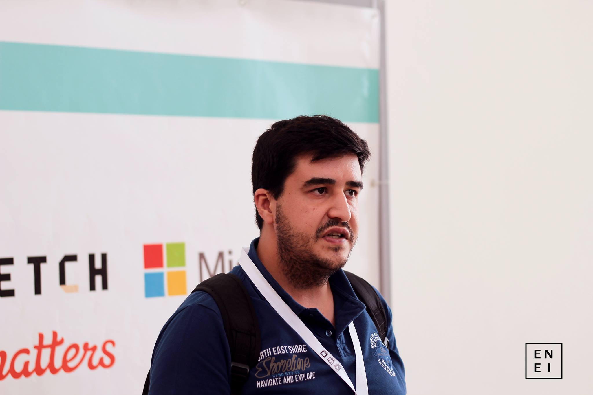

# Professors

::: columns

:::: column
- **Nome:** Mário Antunes
- **E-Mail:** [mario.antunes@ua.pt](mailto:mario.antunes@ua.pt)
- **Gabinete:** 19.2.15 (IT1)
::::

:::: column

::::

:::

# Professors

::: columns

:::: column
- **Nome:** 	Eurico Pedrosa 
- **E-Mail:** [efpua.pt](mailto:efpua.pt)
- **Gabinete:** Iris Lab
::::

:::: column

::::

:::

# Class Introduction

Vamos abordar os seguintes tópicos:

* C1. Introdução à Linha de Comandos
* C2. Virtualização e Contentores
* C3. Versionamento de Código e Colaboração
* C4. Comunicação em Redes IP
* C5. Servidores Web e Tecnologia
* C6. Manipulação de Dados Semiestruturados
* C7. Compilação de Documentos (Latex e Markdown)
* C8. RGPD, Propriedade Intelectual, Ética e Profissionalismo em TI

# Grading

- 50% Teórica + 50% Prática
- Discreta: 25% Projeto 1 + 25% Projeto 2 + 50% Exame
- Época Final: 50% Exame Final + 50% Projeto

# Class Schedule

| Date TP2   | Date TP1   | Topic | Description                        |
|-----------:|-----------:|:-----:|:-----------------------------------|
| 15-09-2025 | 16-09-2025 |    C0 | Setup                              |
| 22-09-2025 | 23-09-2025 |    C1 | Linux terminal                     |
| 29-09-2025 | 30-09-2025 |    C1 | Windows terminal                   |
| 06-10-2025 | 07-10-2025 |    C2 | Virtualization                     |
| 13-10-2025 | 14-10-2025 |    C2 | Containers                         |
| 20-10-2025 | 21-10-2025 |    C2 | Application containers             |
| 27-10-2025 | 28-10-2025 |    C3 | Git & Github                       |
| 03-11-2025 | 04-11-2025 |    C4 | Network configuration              |
| 10-11-2025 | 11-11-2025 |    C4 | Network programing                 |
| 17-11-2025 | 18-11-2025 |    C5 | WebPage & deployment               |
| 24-11-2025 | 25-11-2025 |    C5 | Web programming                    |
| 15-12-2025 | 02-12-2025 |    C6 | Data visualization                 |
| 22-12-2025 | 09-12-2025 |    C7 | Latex & Markdown                   |
| ---------- | 16-12-2025 |    C8 | GDPR, AI Act, Intelectual property |

# Bibliography

- James F. Kurose and Keith W. Ross. 2021. Computer Networking: A Top-Down Approach (8th edition). Pearson.  
- Python Networking 101: Navigating essentials of networking, socket programming, AsyncIO, network testing, simulations and Ansible, Odette Windows, GiftforGits, 2023 
- Mailund, Thomas 2019 Introducing Markdown and Pandoc: Using Markup Language and Document Converter  
- William Shotts 2019 The Linux Command Line, 2nd Edition - A Complete Introduction 
- Paul McFedries 2023 HTML, CSS, & JavaScript All-in-One For Dummies
