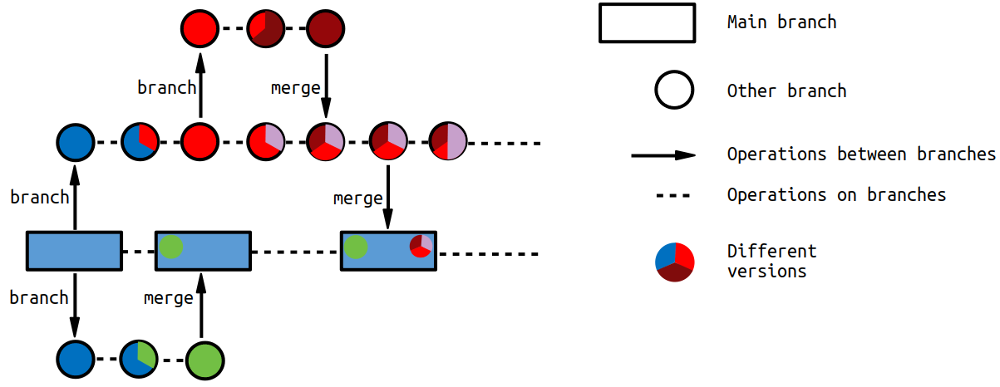
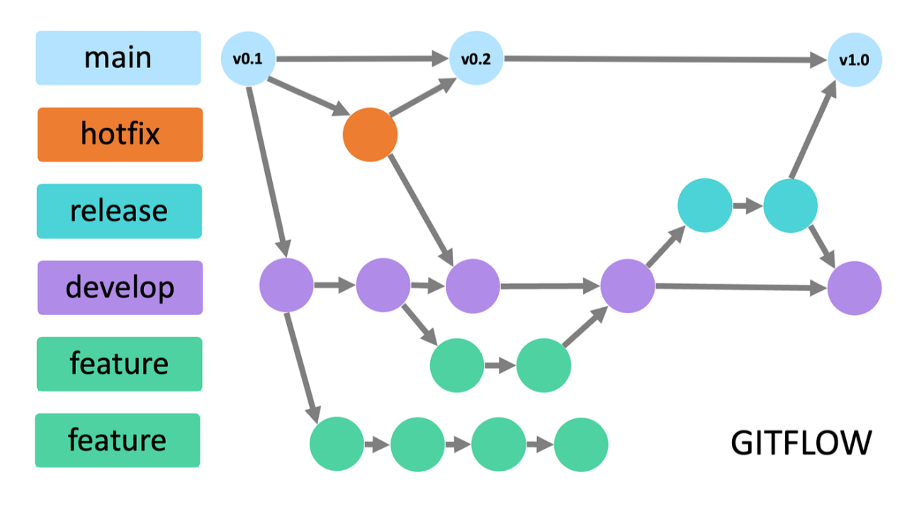

## Git & GitHub
### A Practical Guide to Version Control and Collaboration

## The Chaos Before Version Control

Imagine you're writing a large essay or coding project. Your folder probably looks like this:

* `Project_v1.c`
* `Project_v2_fixed.c`
* `Project_final.c`
* `Project_final_REALLY.c`
* `Project_final_APPROVED_v3.c`

This is confusing, error-prone, and impossible to scale. You have no clear record of *what* changed, *why* it changed, or *when*.

---

## The Collaboration Problem

1. **Method 1: Shared Folders (e.g., Dropbox, Google Drive)**
* These are **file synchronization** tools, not version control tools.
* **Problem:** *File locking.* If two people edit the same file, you get `MyFile (Conflict Copy).doc`. The last person to save *wins,* and work is lost. It only syncs the *latest* version.

2. **Method 2: Emailing Files**
* `Project_v5_Marios_changes.zip`
* `Project_v5_Anas_feedback.zip`
* **Problem:** How do you merge these changes? This is a manual, chaotic process that guarantees failure.

---

## The Solution: A Version Control System (VCS)

A VCS is a system that records changes to a file or set of files over time. It's a **time machine** for your project.

It allows you to:

* See who changed what, and when.
* Revert to any previous version.
* Compare changes over time.
* Safely merge work from multiple people.

---

## Types of VCS: Centralized vs. Distributed

1. **Centralized (CVCS) - e.g., Subversion (SVN)**
* There is **one single central server** that holds the entire project history.
* Developers "check out" the latest version, work, and "check in" their changes.
* **Weakness:** It's a single point of failure. If the server goes down, no one can collaborate or save their history.

---

2. **Distributed (DVCS) - e.g., Git, Mercurial**
* **Every developer** has a full, local copy (a "clone") of the **entire repository**, including its full history.
* The "server" is just another repository that everyone agrees to sync with.
* **Strength:** You can work offline, and the history is safe on dozens of machines.

---

## The Origin of Git

* **Who:** Linus Torvalds (the creator of the Linux Kernel).
* **When:** 2005.
* **Why:** The Linux Kernel team was using a proprietary DVCS called BitKeeper. A licensing change forced them to stop.
* **The Problem:** No other VCS could handle the sheer scale (speed, size, and number of contributors) of the Linux Kernel project.
* **The Solution:** Linus created **Git** in about a week. It was designed from the ground up to be distributed, fast, and to ensure data integrity.

---

## How Git "Thinks": Snapshots, Not Diffs

Many older VCS tools (like SVN) store changes as *deltas* or *diffs* (a list of what changed, line by line).

Git does not. Git "thinks" of its history as a **stream of snapshots**.

When you **commit** (save a version), Git takes a "picture" of what all your files look like at that moment and stores a reference to that snapshot. If a file hasn't changed, Git just links to the previous version of that file.

---

## The Core Concept: The 3 States

This is the most crucial, and sometimes confusing, part of Git. Your files exist in one of three states:

1.  **Working Directory:** All your files and folders on your computer's filesystem. This is your "messy desk."
2.  **Staging Area (Index):** A "drafting" area. This is where you assemble your snapshot. You use `git add` to move files *from* the Working Directory *to* here.
3.  **Repository (.git):** The permanent, immutable database of all your project's snapshots (commits). This is the "file cabinet."

---

## Creating a Repository: `git init`

There are two ways to start a project with Git:

1.  `git clone`: (We'll see this later) Copy an *existing* repository from a server.
2.  `git init`: Create a *new* repository from scratch.

`git init` is the command you run inside a project folder to turn it into a Git repository.

```bash
$ mkdir my-new-project
$ cd my-new-project
$ git init
Initialized empty Git repository in /path/to/my-new-project/.git/
```

This command creates a hidden sub-directory named `.git`. This `.git` folder is the "brain" of your repository—it contains all the snapshots, branches, and history.

---

## The Core Workflow: `add` & `commit`

1.  You modify files in your **Working Directory**.
2.  You run `git status` to see what has changed.
3.  You use `git add <filename>` to move your desired changes from the Working Directory to the **Staging Area**.
4.  You use `git commit -m "My message"` to take everything in the Staging Area, create a permanent **snapshot** (a commit), and save it to your **Repository**.

The commit message is vital. It should explain *why* you made the change, not *what* you changed (the code shows what).

---

## What Makes a *Good* Commit Message? 

A commit message is a log for your future self and your teammates. 
A good message provides context and answers *why* a change was made.
The community standard follows a *50/72* rule:

  * **Subject:** A short summary, 50 characters or less.
  * (Leave one blank line)
  * **Body:** A detailed explanation, wrapping lines at 72 characters.

---

## The 7 Rules of a Great Commit Message

1.  **Use the imperative mood in the subject.**

      * **Good:** `Add login page`
      * **Bad:** `Added login page` or `Adding login page` (Think of it as a command: "This commit will...")

2.  **Separate the subject from the body with a blank line.**

3.  **Limit the subject line to 50 characters.**

4.  **Do not end the subject line with a period.**

5.  **Capitalize the subject line.**

6.  **Wrap the body at 72 characters.**

7.  **Use the body to explain *what* and *why* vs. *how*.** The code shows *how*.

---

## Example: Good vs. Bad

**Bad Commit:**
`git commit -m "fix stuff"`

**Good Commit:**

```git
git commit -m "Fix: Correct user authentication logic" -m "

The previous login function failed to hash the password before
comparing it to the database, resulting in a critical security
vulnerability.

This commit applies the SHA-256 hashing function to the user's
input before the database query. This resolves the security flaw."
```

---

## The Power of Git: `branch`

A **branch** is simply a lightweight, movable pointer to one of your commits. The main branch is typically called `main` or `master` (depracated as of late).

**Why use branches?** To work on new features or fix bugs in **isolation** without breaking the stable code on the `main` branch.

* `git branch <name>`: Creates a new branch.
* `git checkout <name>`: Switches your Working Directory to that branch.
* `git checkout -b <name>`: A shortcut that creates and switches in one step.

---

## Visualizing Branches & Merging

This diagram shows the relationship between different branches.

  * Work starts on the **Main branch** (rectangles).
  * A new `branch` is created to work on a feature (circles).
  * When the feature is complete, it is `merged` back into the main branch.

{ width=85% }

---

## Viewing History: `git log`

Once you have commits, you need to see them.

* `git log`: Shows the full commit history, with authors, dates, and messages.
* `git log --oneline`: Shows a compact, one-line view of the history.
* `git log --graph --oneline`: Shows the history with ASCII art representing the branches and merges.

---

## Combining Work: `merge`

After you finish your work on a feature branch (e.g., `feature/login`), you need to integrate it back into `main`.

A **`merge`** joins the histories of two branches.

1.  Switch to the branch you want to update: `git checkout main`
2.  Run the merge: `git merge feature/login`

Git will create a new "merge commit" that ties the two histories together.

---

## The Inevitable: Merge Conflicts!

A merge conflict happens when you try to merge two branches that have **edited the same line in the same file**. Git doesn't know which change is correct, so it stops and asks you to fix it manually.

1.  Git will mark the file with `<<<<<<<` and `>>>>>>>` to show you both conflicting versions.
2.  You must open the file, delete the markers, and edit the code to be correct.
3.  You then `git add` the fixed file and run `git commit` to finalize the merge.

---

## Alternative to Merging: `rebase`

A **`rebase`** is a way of "rewriting history" to keep it clean and linear.

Instead of a "merge commit," `rebase` takes all the commits from your feature branch and **re-applies them, one by one,** on top of the latest version of the `main` branch.

* **Result:** A clean, single-file-line history.
* **Warning:** This is a powerful, history-altering command. **NEVER** rebase public branches that other people are using.

---

## Collaboration - Git & GitHub: `remote` & `origin`

So far, everything has been local. How do you share?

* A **`remote`** is a named connection to a Git repository in another location (e.g., on a server).
* **`origin`** is the default, conventional name for your main `remote` (the server you cloned from or want to push to).

---

## The Main Collaboration Commands

* `git clone [url]`: Downloads a full copy (a clone) of a remote repository to your machine and sets up the `origin` connection.
* `git pull`: ("Pulls") Fetches changes from `origin` and merges them into your local branch. It's `git fetch` + `git merge`.
* `git push`: ("Pushes") Uploads your local commits (that the remote doesn't have) to `origin`.

---

## Git vs. GitHub

This is a critical distinction.

* **Git** is the **tool**. It's the distributed, command-line VCS you install on your computer.
* **GitHub** is a **service**. It's a web-based company (founded in 2008, now owned by Microsoft) that **hosts** Git repositories.

GitHub provides a "social layer" on top of Git, adding features like issue tracking, wikis, and Pull Requests.

---

## The Open-Source Workflow: `fork`

You can't just `push` your changes to a project you don't own (like the official Python repository).

A **`fork`** is a **personal, server-side copy** of someone else's repository. It lives in your GitHub account, and you have full control over it. This is the first step to contributing.

---

## The Heart of Collaboration: `pull request`

A **Pull Request (PR)** is a formal request for a project owner to "pull" (merge) your changes from your branch (or fork) into their main branch.

A PR is the start of a **conversation**. It is *not* just a command. It's a web page on GitHub where:
* You describe *why* you made the changes.
* Your team can **review your code** line by line.
* You can discuss improvements.
* Automated tests can be run.
* The project owner can approve and merge your code.

---

## A Typical Git Workflow (Summary)

1.  `git clone [url]`: Get the project from a remote server (like GitHub).
2.  `git checkout -b new-feature`: Create a new branch to work in isolation.
3.  ... *Write your code, make your changes* ...
4.  `git add .` : Stage your changed files.
5.  `git commit -m "Add login functionality"`: Save a snapshot of your work.

---

6.  `git push origin new-feature`: Upload your branch to the remote server.
7.  **Go to GitHub:** Open a **Pull Request** to propose your changes.
8.  **Discuss / Review:** Your team reviews your code.
9.  **Merge:** A project maintainer merges your PR into the `main` branch.
10. `git checkout main`: Switch back to your local `main` branch.
11. `git pull origin main`: Update your local `main` with the newly merged code.

---

## Advanced Workflow: "GitFlow"

While your typical workflow is great for small projects, larger projects often use a more structured, formal model like **GitFlow**.

  * **`main`**: Only contains official, tagged releases. You never commit here directly.
  * **`develop`**: The main integration branch for all new features.
  * **`feature`** branches: Created from `develop` and merged back into `develop`.
  * **`release`** branches: Created from `develop` to prepare a new release (final bug fixes).
  * **`hotfix`** branches: Created from `main` to patch urgent production bugs.

-----

{ width=85% }

---

## Marking Versions: `tag` & `release`

When your project reaches a stable point (e.g., `v1.0.0`), you want to mark it.

* **`git tag v1.0.0`**: A "tag" is a permanent pointer that points to a specific commit. Unlike a branch, a tag is not meant to move. It's an anchor in your history.
* **GitHub Releases:** A "Release" is a feature on GitHub that is built on top of a tag. It's a formal web page for your release that lets you:
    * Write a "changelog" (what's new).
    * Attach binary files (like `.exe` or `.zip` installers).
    * Mark it as a "pre-release."

This is how you officially present a new version to your users.

---

## Summary: Git vs. GitHub

  * **Git** is the distributed **tool** on your computer for tracking changes (snapshots).
      * `init`, `add`, `commit`, `branch`, `merge`, `pull`, `push`
  * **GitHub** is the social web **service** that hosts your repositories and facilitates collaboration.
      * `Fork`, `Pull Request`, `Issues`, `Releases`
  * **Core Workflow:**
    `Branch` ➡️ `Add` ➡️ `Commit` ➡️ `Push` ➡️ `Pull Request` ➡️ `Merge`
  * **Golden Rule:** Work in isolation on branches. Only merge clean, finished work into `main`.

---

## Further Reading & Resources 📚

  * **Pro Git Book:** The definitive guide to Git, available free online.
      * [https://git-scm.com/book/](https://git-scm.com/book/)
  * **GitHub Hello World Guide:** A simple, 10-minute tutorial to get started.
      * [https://docs.github.com/en/get-started/quickstart/hello-world](https://docs.github.com/en/get-started/quickstart/hello-world)
  * **Learn Git Branching (Interactive):** An interactive game-like tutorial to learn branching.
      * [https://learngitbranching.js.org/](https://learngitbranching.js.org/)
  * **Git Cheat Sheet (Atlassian):** A great one-page reference for common commands.
      * [https://www.atlassian.com/git/tutorials/atlassian-git-cheatsheet](https://www.atlassian.com/git/tutorials/atlassian-git-cheatsheet)