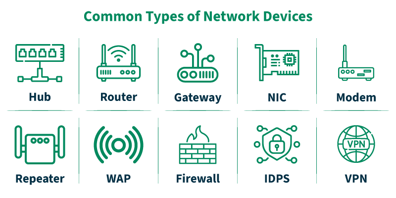
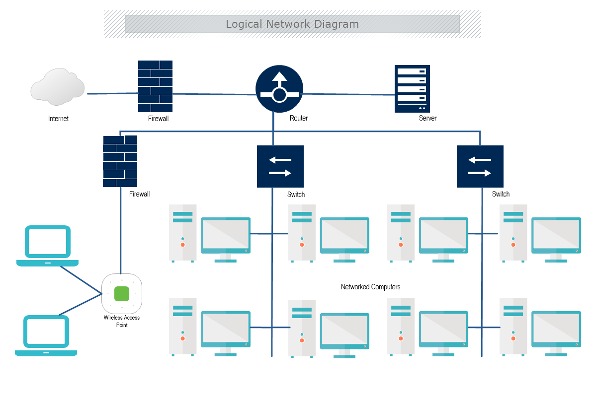
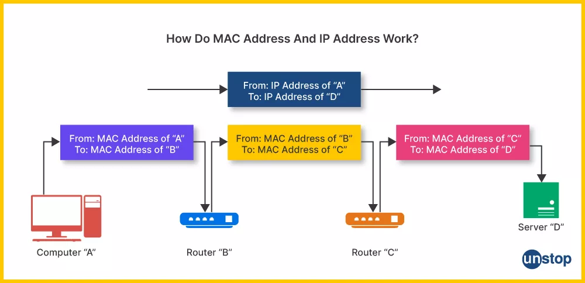
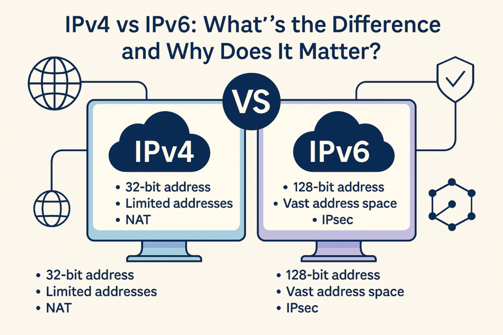

# Porque é que as Redes são Importantes

## Porque é que as Redes são Importantes 🌐 {.allowframebreaks}

As redes são o tecido invisível do mundo moderno.
Já não se trata apenas de computadores; trata-se de *tudo*.

* **Comunicação:** De email e redes sociais a videochamadas.
* **Serviços:** Cloud computing, streaming (Netflix, Spotify) e jogos online.
* **Economia:** E-commerce, banca e sistemas financeiros globais.
* **IoT (Internet of Things):** Casas inteligentes, tecnologia "wearable" e carros conectados.

Compreender redes já não é opcional; é uma competência fundamental para qualquer tecnólogo.

# Parte 1: Os Blocos de Construção 🧱

## Equipamentos de Rede Essenciais {.allowframebreaks}

Primeiro, vamos conhecer o hardware que constrói uma rede.

* **Hub:** Um repetidor "burro". Qualquer pacote que recebe é transmitido para *todas* as outras portas. É lento, ineficiente e cria "colisões". (Raramente usado hoje).
* **Switch:** Um dispositivo "inteligente" para uma LAN. Aprende que dispositivo está em que porta (usando endereços MAC) e envia pacotes *apenas* para o destinatário pretendido.
* **Router:** Um "gateway" que conecta redes *diferentes*. O router da sua casa conecta a sua LAN privada à WAN do seu provedor (a Internet).
* **Access Point (AP):** Um "tradutor" que conecta dispositivos sem fios (usando Wi-Fi) à rede com fios (o switch).
* **ONT (Optical Network Terminal):** O seu "modem" para uma ligação de fibra ótica. Traduz sinais de luz do cabo de fibra em sinais elétricos para o seu router (Ethernet).



## Equipamentos de Rede Essenciais Conectados



## O Sistema de Dois Endereços: MAC & IP {.allowframebreaks}

Cada dispositivo numa rede tem **dois** endereços.
Ambos são cruciais.

* **Endereço MAC (Endereço Físico):**
    * Exemplo: `00:1A:2B:3C:4D:5E`
    * Um número de série único de 48 bits, gravado na placa de rede pelo fabricante. É permanente.
    * **Usado para:** Comunicação *dentro* da mesma Rede Local (LAN).
* **Endereço IP (Endereço Lógico):**
    * Exemplo: `192.168.1.10`
    * Um endereço lógico de 32 bits (ou 128 bits para IPv6) atribuído ao dispositivo pela rede (ex: pelo seu router). É temporário.
    * **Usado para:** Comunicação *entre* redes diferentes (na WAN/Internet).

**Analogia:** Um endereço MAC é como o seu **número de passaporte** (permanente, identifica-o). Um endereço IP é como a sua **morada de casa** (lógica, muda se você se mudar).



## Como as LANs *Realmente* Funcionam: ARP {.allowframebreaks}

O seu computador (192.168.1.10) quer enviar um pacote para a sua impressora (192.168.1.15) na mesma LAN.

* O **Router** só entende endereços IP.
* O **Switch** (que os conecta) só entende endereços MAC.

Como é que o computador descobre o endereço MAC da impressora?

1.  Ele "grita" para toda a LAN: "QUEM TEM O 192.168.1.15?" Este broadcast é o **Protocolo de Resolução de Endereços (ARP)**.
2.  A impressora (192.168.1.15) responde: "EU TENHO! O meu MAC é `00:AB:CD:EF:12:34`."
3.  O seu computador armazena este par `IP -> MAC` na sua **tabela ARP** e envia o pacote.

## A Linguagem: IPv4 & A Máscara de Sub-rede {.allowframebreaks}

Um endereço IPv4 por si só não é suficiente. Está sempre emparelhado com uma **Máscara de Sub-rede**.

* **Endereço IP:** `192.168.1.10`
* **Máscara de Sub-rede:** `255.255.255.0`

O trabalho da máscara de sub-rede é dividir o IP em duas partes:

1.  **Parte de Rede:** `192.168.1.x` ("Em que rua estou?")
2.  **Parte de Host:** `x.x.x.10` ("Qual é o número da minha porta?")

É assim que o seu computador sabe se outro IP é **local** (na mesma rede) ou **remoto** (numa rede diferente).

## Intervalos de Endereços IPv4 Especiais {.allowframebreaks}

Nem todos os IPs são iguais.
Eles são reservados para usos específicos.

* **Endereço de Loopback (localhost):**
    * `127.0.0.1`
    * Este endereço significa sempre **"este computador"**. É uma interface virtual usada para testar aplicações na sua própria máquina.
* **Endereços Privados / LAN:**
    * `10.0.0.0` – `10.255.255.255`
    * `172.16.0.0` – `172.31.255.255`
    * `192.168.0.0` – `192.168.255.255`
    * Estes são para uso *dentro* de uma rede privada (LAN). Não são roteáveis na Internet pública.
* **Endereços Públicos / WAN:**
    * Qualquer outro endereço (ex: `8.8.8.8` ou `142.250.184.142`).
    * Estes são globalmente únicos e roteáveis na Internet.

## Compreender Endereços IPv6 {.allowframebreaks}

O IPv4 ficou sem endereços.
O IPv6 é o sucessor e tem os seus próprios tipos especiais.

* **IPv6 (Internet Protocol v6):**
    * Um endereço de **128 bits** (ex: `2001:0db8:85a3::8a2e:0370:7334`).
    * Fornece um fornecimento virtualmente ilimitado de endereços.
* **Endereços IPv6 Especiais:**
    * **Loopback:** `::1` (O equivalente a `127.0.0.1`).
    * **Link-Local:** `fe80::...` (Atribuído automaticamente para comunicação *local* na LAN. Como o ARP para IPv6).
    * **Unique Local:** `fd00::...` (O equivalente aos intervalos privados de IPv4).

## IPv4 vs. IPv6



## Endereços Não São Suficientes: Portas {.allowframebreaks}

Um endereço IP leva um pacote de dados ao *computador* certo.
Uma **Porta** leva-o à *aplicação* certa nesse computador.

* **Analogia:** Se um IP é a morada do prédio, a porta é o número do apartamento ou escritório.
* **Portas Comuns:**
    * `80`: **HTTP** (Web)
    * `443`: **HTTPS** (Web Segura)
    * `22`: **SSH** (Secure Shell)

Uma ligação é feita a um **IP + Porta** (ex: `172.217.14.228:443`).

# Parte 2: O Mundo Alargado (WAN) 🌍 {.allowframebreaks}

## Sair da LAN: O Default Gateway {.allowframebreaks}

1.  O seu computador (192.168.1.10) quer enviar um pacote para o Google (8.8.8.8).
2.  Ele olha para a sua máscara de sub-rede (`255.255.255.0`).
3.  Percebe que 8.8.8.8 **não** está na sua rede local.
4.  Não pode enviar o pacote diretamente. Por isso, envia-o para o **Default Gateway**.

O **Default Gateway** (Gateway Padrão) é o endereço IP do **Router** na LAN (ex: `192.168.1.1`). É a "porta" para fora da sua rede local, responsável por encaminhar todo o tráfego não local.

## Conectar Redes: Roteamento {.allowframebreaks}

Assim que o pacote chega ao seu router, o que se segue?

* A **WAN (Wide Area Network)** é uma rede de redes (a Internet!).
* **Roteamento** (ou Encaminhamento) é o processo de encontrar o melhor caminho para os pacotes de dados viajarem da sua origem até ao seu destino, saltando entre milhares de routers diferentes por todo o globo.

## O "Rececionista": NAT {.allowframebreaks}

**NAT (Network Address Translation ou Tradução de Endereços de Rede)** é a solução inteligente para a escassez de endereços IPv4.

* Permite que uma rede privada inteira (ex: todos os 50 dispositivos na sua casa com endereços `192.168.1.x`) se "esconda" atrás de **um único endereço IP público**.
* O seu router atua como um "rececionista", mantendo um registo de todos os pedidos que saem e garantindo que as respostas voltam ao dispositivo privado correto.

Tente usar o [IPinfo](https://ipinfo.io/what-is-my-ip) para identificar o seu IP público.

## A "Lista Telefónica": DNS {.allowframebreaks}

Nós lembramo-nos de nomes (`google.com`), mas os computadores só entendem números (`142.250.184.142`).

**DNS (Domain Name System ou Sistema de Nomes de Domínio)** é a "lista telefónica da Internet". É um sistema global e distribuído que traduz nomes de domínio legíveis por humanos em endereços IP legíveis por máquinas.

## Mais Magia DNS: mDNS & DDNS {.allowframebreaks}

* **mDNS (Multicast DNS):**
    * Isto é DNS "local". Permite que dispositivos na sua LAN se encontrem por nome *sem* um servidor DNS central.
    * É assim que `meu-portatil.local` ou a sua impressora "aparecem" automaticamente.

* **DDNS (Dynamic DNS):**
    * O endereço IP público da sua casa pode mudar (é "dinâmico").
    * DDNS é um serviço que atualiza automaticamente um nome de domínio para apontar para o seu novo endereço IP sempre que ele muda.
    * Isto é útil para hospedar um servidor (ex: Nextcloud) em casa.

## Manter a Rede a Funcionar: NTP & SNMP {.allowframebreaks}

* **NTP (Network Time Protocol):**
    * Mantém os relógios em todos os computadores e dispositivos de rede sincronizados.
    * Isto é **crítico** para segurança (certificados de encriptação), transações financeiras e ficheiros de log precisos.

* **SNMP (Simple Network Management Protocol):**
    * Usado por administradores de rede para monitorizar a saúde, desempenho e configuração de routers, switches e servidores.

# Parte 3: Protocolos de Aplicação 🗣️

## O que *Fazemos* na Rede {.allowframebreaks}

Protocolos são as "regras de conversação" para tarefas específicas.

* **HTTP (HyperText Transfer Protocol):** O protocolo fundamental para a World Wide Web. É como o seu browser *pede* páginas web.
* **HTTPS (HTTP Secure):** É apenas HTTP em cima de encriptação **SSL/TLS**. Garante que a sua comunicação é privada e segura. **Procure sempre pelo 🔒!**

## Protocolos de Email {.allowframebreaks}

* **SMTP (Simple Mail Transfer Protocol):**
    * Usado para *enviar* email.
* **POP3 (Post Office Protocol):**
    * Usado para *receber* email.
    * *Descarrega* o correio para o seu dispositivo e (normalmente) apaga-o do servidor. Este é um modelo mais antigo.
* **IMAP (Internet Message Access Protocol):**
    * Usado para *receber* email.
    * *Sincroniza* o seu correio com o servidor. Este é o modelo moderno. O que faz no seu telemóvel aparece no seu portátil.

## Protocolos de Sistema & Ficheiros {.allowframebreaks}

* **SSH (Secure Shell):**
    * A ferramenta mais importante para administradores de sistemas.
    * Fornece uma ligação de linha de comandos encriptada a um servidor remoto.
* **FTP (File Transfer Protocol):**
    * Um protocolo antigo e *inseguro* (texto plano) para transferir ficheiros. **Evite-o.**
    * Use **SFTP** (que corre sobre SSH) em vez disso.
* **WebDAV / CalDAV / CardDAV:**
    * Extensões do HTTP que permitem gerir ficheiros (WebDAV), calendários (CalDAV) e contactos (CardDAV) num servidor web. Usado por serviços como o Nextcloud.

## Protocolos IoT: MQTT {.allowframebreaks}

* **MQTT (Message Queuing Telemetry Transport):**
    * Um protocolo muito leve e eficiente desenhado para mensagens do tipo "publicar" e "subscrever" (modelo pub/sub).
    * Perfeito para **IoT (Internet of Things)**: sensores, lâmpadas inteligentes e pequenos dispositivos que precisam de enviar mensagens minúsculas de forma fiável e com baixo consumo de energia.

# Parte 4: Gestão & Diagnóstico 🩺

## Configuração de Rede {.allowframebreaks}

Como é que o seu dispositivo obtém um endereço IP?

* **Windows:**
    * Gerido através do **Painel de Controlo** ou da aplicação Definições.
* **Linux (Desktop):**
    * Quase sempre gerido pelo **NetworkManager**, um serviço user-friendly com uma interface gráfica (o seu ícone de rede).
* **Linux (Servidor):**
    * Frequentemente gerido por **`systemd-networkd`**.
    * A configuração é feita através de ficheiros de texto simples em `/etc/systemd/network/`.

## Configuração Automática: DHCP 🤖 {.allowframebreaks}

No último slide, perguntámos: "Como é que o seu dispositivo obtém um endereço IP?" Para 99% dos dispositivos, a resposta é **DHCP (Dynamic Host Configuration Protocol)**.

Definir manualmente um IP em cada telemóvel, portátil e smart TV (um **IP estático**) seria um pesadelo. O DHCP automatiza isto.

1.  O seu dispositivo junta-se a uma rede e "grita" uma mensagem **DHCP Discover**: "Há algum servidor DHCP por aí? Preciso de um IP!"
2.  Um **Servidor DHCP** (normalmente o seu router) responde com uma **Oferta DHCP**: "Aqui, podes *usar* o `192.168.1.50`."
3.  O seu dispositivo aceita com um **Pedido DHCP**, e o servidor confirma com um **DHCP ACK** (Confirmação).

## Concessões DHCP & Intervalos de IP {.allowframebreaks}

O DHCP não lhe dá um IP para sempre. Dá-lhe uma **concessão** (lease).

* **Tempo de Concessão:** O IP é "alugado" ao seu dispositivo por um tempo específico (ex: 24 horas). Antes de expirar, o seu dispositivo deve renovar a concessão. Isto garante que os IPs de dispositivos que saem da rede são eventualmente devolvidos à "pool".
* **Intervalo de IP (Pool):** O servidor DHCP é configurado para gerir um *intervalo* de endereços (ex: `192.168.1.100` a `192.168.1.200`).
* **Atribuição Estática:** Ao usar apenas um intervalo, o servidor deixa outros IPs livres (ex: `192.168.1.1` a `192.168.1.99`) para **atribuição estática**. Estes são configurados manualmente em dispositivos importantes como servidores, impressoras e o próprio router, para que os seus endereços nunca mudem.

## Ferramenta de Diagnóstico 1: `ping` {.allowframebreaks}

* **A Pergunta:** "Estás aí?"
* **A Ação:** Envia um pequeno pacote (ICMP Echo Request) e espera por uma resposta.
* **A Resposta:** Diz-lhe se um host está alcançável e quanto tempo demorou a ida e volta (esta é a **latência**).
* **Exemplo:** `ping google.com`

## Ferramenta de Diagnóstico 2: `traceroute` {.allowframebreaks}

* **A Pergunta:** "Que caminho é que os meus pacotes levam para chegar até ti?"
* **A Ação:** Envia pacotes com valores crescentes de "Time-To-Live" (TTL).
* **A Resposta:** Mostra-lhe cada router (ou "salto") pelo qual o seu pacote passa a caminho do destino. Ótimo para descobrir *onde* uma ligação está a falhar.
* **Exemplo:** `traceroute google.com`

## Ferramenta de Diagnóstico 3: `ip`, `dig`, `nmap` {.allowframebreaks}

* **`ip addr show`**
    * A ferramenta Linux moderna para ver a sua *própria* configuração IP e interfaces de rede. (Substitui o antigo `ifconfig`).
* **`dig google.com`**
    * **A Pergunta:** "Qual é o endereço IP para este nome?"
    * **A Ação:** Realiza uma pesquisa DNS.
* **`nmap localhost`**
    * **A Pergunta:** "Que portas estão abertas nesta máquina?"
    * **A Ação:** Um poderoso scanner de portas.
    * **A Resposta:** Relata que portas estão abertas e que serviços estão (provavelmente) a correr nelas.

# Parte 5: Segurança & Tópicos Avançados 🚀

## Monitorização de Rede: Wireshark {.allowframebreaks}

* **A Ferramenta:** O Wireshark é um "network sniffer" ou analisador de protocolos.
* **A Ação:** Captura *todos os pacotes* que viajam na sua interface de rede e permite-lhe inspecionar o seu conteúdo.
* **Analogia:** É como uma câmara de vídeo para o tráfego da sua rede.
* **Uso:** A ferramenta mais poderosa para depurar problemas complexos de rede.

## Segurança de Rede: Firewalls {.allowframebreaks}

Uma **firewall** é o "segurança" da sua rede ou computador.

* Inspeci-ona todo o tráfego de rede de entrada e saída.
* Decide se **permite** ou **bloqueia** cada pacote com base num conjunto de regras (ex: "Permitir tráfego na porta 443, bloquear tudo o resto").
* Esta é a sua primeira linha de defesa.

## Exemplos de Firewall {.allowframebreaks}

* **iptables:** A firewall clássica, poderosa, de linha de comandos, integrada no kernel Linux há décadas.
* **nftables:** O sucessor moderno do `iptables` no Linux. Tem uma sintaxe mais simples e melhor desempenho.
* **pfSense:** Um **sistema operativo de firewall** gratuito e de código aberto. Você instala-o num computador dedicado para o transformar num router e firewall de nível empresarial extremamente potente para toda a sua rede.

## O Poder do SSH: VS Code Remote {.allowframebreaks}

O SSH é mais do que apenas uma shell remota.
A extensão "Remote - SSH" no VS Code é revolucionária.

* **Como funciona:** A interface do seu editor corre localmente, mas toda a edição de ficheiros, comandos de terminal e processamento de linguagem correm no servidor remoto.
* Você obtém o poder de um servidor com o conforto do seu editor local.

## O Poder do SSH: Túneis & X11 {.allowframebreaks}

* **Túneis SSH (Port Forwarding):**
    * Permite "embrulhar" tráfego de rede de forma segura dentro de uma ligação SSH.
    * **Exemplo:** Aceder a uma base de dados a correr em `localhost:5432` num servidor remoto como se estivesse a correr no `localhost:5432` da *sua própria* máquina.
* **Encaminhamento X11 (X11 Forwarding):**
    * Permite executar uma aplicação *gráfica* (como o `firefox` ou um editor de texto) num servidor Linux remoto, mas ver e interagir com a janela no seu desktop local.

## Sincronizar Ficheiros: `rsync` sobre SSH {.allowframebreaks}

A melhor forma de transferir e sincronizar ficheiros.
O `rsync` é rápido, eficiente e versátil.

* **Porque é rápido:** Copia apenas as **diferenças** (deltas) entre ficheiros, não o ficheiro inteiro.
* Funciona perfeitamente sobre uma ligação SSH.
* **Comando:**

```bash
# Sincronizar uma pasta local PARA um servidor remoto
$ rsync -avzP ./o-meu-projeto/ user@host:~/projetos/
```

## A Web Moderna: Proxy Reverso {.allowframebreaks}

Um **Proxy Reverso** (como NGINX ou Caddy) é um servidor que se senta *à frente* dos seus servidores de aplicação reais.

  * Recebe todo o tráfego de entrada da Internet.
  * De seguida, "encaminha" (faz proxy) o pedido para a aplicação interna correta (ex: a sua app Python, a sua app Node.js).
  * **Usos:**
      * **Balanceamento de Carga (Load Balancing):** Distribuir tráfego por múltiplos servidores de aplicação.
      * **Segurança:** Esconder os seus servidores de aplicação da Internet.
      * **Hospedagem:** Hospedar múltiplos websites num único endereço IP.

## A Web Moderna: HTTPS & Let's Encrypt {.allowframebreaks}

  * **HTTPS** é essencial. Fornece a encriptação (SSL/TLS) que mantém os dados do utilizador privados e prova a identidade do seu site.
  * **O Problema:** Os certificados costumavam ser caros e difíceis de instalar.
  * **A Solução: Let's Encrypt**
      * Uma **Autoridade de Certificação (CA)** gratuita, automatizada e aberta.
      * Fornece certificados SSL/TLS gratuitos e ferramentas (como o `certbot`) para os instalar e renovar automaticamente.
      * Tornou toda a web mais segura.

# Leitura Adicional & Recursos 📚

## Leitura Adicional & Recursos 📚 {.allowframebreaks}

  * **Wireshark:** [https://www.wireshark.org/](https://www.wireshark.org/)
  * **Nmap:** [https://nmap.org/](https://nmap.org/)
  * **Let's Encrypt:** [https://letsencrypt.org/](https://letsencrypt.org/)
  * **Guia do comando `ip`:** [https://www.geeksforgeeks.org/ip-command-in-linux-with-examples/](https://www.geeksforgeeks.org/ip-command-in-linux-with-examples/)
  * **Guia do `rsync`:** [https://www.digitalocean.com/community/tutorials/how-to-use-rsync-to-sync-local-and-remote-directories](https://www.digitalocean.com/community/tutorials/how-to-use-rsync-to-sync-local-and-remote-directories)
  * **Guia da Mozilla para HTTP:** [https://developer.mozilla.org/en-US/docs/Web/HTTP/Overview](https://developer.mozilla.org/en-US/docs/Web/HTTP/Overview)
