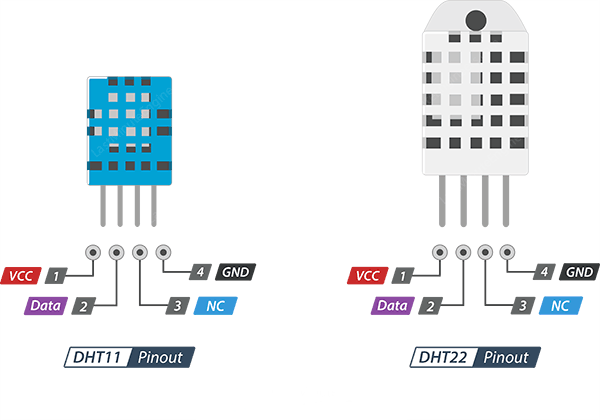

# Exercises

## Step 0: Setup

Before you begin, let's set up your system with all the necessary tools for these exercises.

### 1. System Tools and Python

First, update your package lists and install the core utilities: `curl` and `wget` for testing web services,
and Python's package manager (`pip`) and virtual environment module (`venv`).

```bash
# 1. Update your package lists
sudo apt update; sudo apt full-upgrade -y; \
sudo apt autoremove -y; sudo apt autoclean

# 2. Install general tools, flatpak, and Python essentials
sudo apt install -y udisks2 curl wget \
flatpak python3-pip python3-venv

# 3. Add the Flathub repository
flatpak --user remote-add --if-not-exists \
flathub https://flathub.org/repo/flathub.flatpakrepo
```

### 2. Thonny IDE (for Exercise 5)

Thonny is a simple IDE for MicroPython.
We'll install it using Flatpak to get the latest version.

```bash
# 1. Install Thonny
flatpak --user install flathub org.thonny.Thonny

# 2. Add user to dialout group
sudo usermod -a -G dialout $USER
```

The `dialout` group provides full and direct access to serial ports.
Members of this group can connect to serial devices (through serial connections or USB).

You can then run Thonny from your application menu or with `flatpak run org.thonny.Thonny`.

For native Linux users, no more steps are needed.
For WSL and virtualized OSs, however, a few additional steps are required.
Check Sections [5.1](#wsl-usb-passthrough) and [5.2](#virtualbox-usb-passthrough) respectively.

### 3. 🐍 Python Best Practices

For each Python exercise, please follow these steps:

1.  Create a new directory for the project (e.g., `mkdir ex01 && cd ex01`).
2.  Create an isolated virtual environment:

    ```bash
    python3 -m venv venv
    ```

3.  Activate the environment:

    ```bash
    source venv/bin/activate
    ```

4.  Create a `requirements.txt` file (as specified in each exercise) and install from it:

    ```bash
    pip install -r requirements.txt
    ```

5.  **Use the `logging` module** instead of `print()` for all your status messages.

    ```python
    import logging
    logging.basicConfig(level=logging.INFO, format='%(message)s')
    logger = logging.GoogletLogger(__name__)

    logger.info("This is an info message.")
    ```

### 4. Network architecture

You will typically use Eduroam to access the internet during classes.
For most activities, this is sufficient; however, this network (managed by the university) blocks communication between student **equipment**.

As such, we provide a separate wireless network named `TheOffice` that can be used to connect user applications **to each other**.
This is **optional** (but recommended) for **exercises** 1-4 but **required** for exercise 5.

📶 Wi-Fi Network Details:

| SSID (Network Name) | Password |
| :--- | :--- |
| `TheOffice` | `8006002030` |
| `TheOffice5G` | `8006002030` |

{ width=50% }

## Exercise 1: UDP File Transfer

**Goal:** Explore the provided `file_transfer.py` script.
Understand how it uses `asyncio` to create a persistent server that can handle multiple file uploads from clients.

**Details:**

  * **Server:** The server is persistent. It uses a `dict` to manage file transfers from different clients, keyed by their IP and port (`addr`).
  * **Client:** The client sends the file metadata (filename, size) first, then sends the data chunks, showing a progress bar using `tqdm`.
  * **Protocol:** The script uses a simple newline-based protocol:
      * `START:<total_chunks>:<total_size>:<filename>`
      * `DATA:<chunk_num>:<data_chunk>`
      * `END`
      * The server responds with `ACK_ALL` or `ACK_FAIL`.

**Instructions:**

1.  Create a new directory `ex01` and move into it `cd ex01`.
2.  Download the solution [code](https://github.com/detiuaveiro/tia/tree/master/classes/class_08/02_support/ex01) into this directory.
3.  Activate a `venv` and install the requirements:

    ```bash
    python3 -m venv venv
    source venv/bin/activate
    pip install -r requirements.txt
    ```

4.  Create a file to send, e.g., `echo "This is a UDP test file." > test.txt`.
5.  **Run the Server (Terminal 1):**

    ```bash
    python file_transfer.py receive --port 9999
    ```

6.  **Run the Client (Terminal 2):**

    ```bash
    python file_transfer.py send test.txt --host 127.0.0.1 --port 9999
    ```

## Exercise 2: Remote Tic-Tac-Toe

**Goal:** Analyze the provided `main.py` script to see how `asyncio` can be integrated with a GUI library like Pygame to create a networked application.

**Details:**

  * **GUI Menus:** The script uses Pygame to draw all its own menus. It does not use `argparse`.
  * **Async Game Loop:** The main `while running:` loop is `async`. It yields control to the `asyncio` event loop by calling `await asyncio.sleep(1/FPS)`.
  * **Networking:** The script uses `asyncio.start_server` (for the host) and `asyncio.open_connection` (for the client) to create reliable TCP streams.
  * **Error Handling:** The `run()` and `close_connection()` functions use `try...finally` and handle `asyncio.CancelledError` to ensure the application shuts down cleanly.

**Instructions:**

1.  Create a new directory `ex02` and move into it `cd ex02`.
2.  Download the solution [code](https://github.com/mariolpantunes/tictactoe/archive/refs/tags/tictactoe-2.0.tar.gz) into this directory.
3.  Activate a `venv` and install the requirements:

    ```bash
    python3 -m venv venv
    source venv/bin/activate
    pip install -r requirements.txt
    ```

4.  **Run the Host (Player X):**

    ```bash
    python main.py
    ```

      * In the GUI, click "Host Game" -> enter a port (e.g., `8888`) -> Press Enter.
5.  **Run the Client (Player O):**

    ```bash
    python main.py
    ```

    * In the GUI, click "Join Game" -> enter the host's IP (`127.0.0.1` if on the same machine) -> Press Enter -> enter the port (`8888`) -> Press Enter.

## Exercise 3: FastAPI Caching Service

**Goal:** Run and test the provided `main.py` script to understand how to build a high-performance, caching API endpoint.

**Details:**

  * **Endpoint:** The script provides a `GET /ip/{ip_address}` endpoint.
  * **Cache:** It uses a local `ip_cache.json` file.
  * **Logic:** It checks the `timestamp` of a cached entry against a `CACHE_DEADLINE_SECONDS`.
  * **External API:** If the cache is stale or missing, it uses the `requests` library to fetch live data.

**Instructions:**

1.  Create a new directory `ex03` and move into it `cd ex03`.
2.  Download the solution [code](https://github.com/detiuaveiro/tia/tree/master/classes/class_08/02_support/ex03) into this directory.
3.  Activate a `venv` and install the requirements:

    ```bash
    python3 -m venv venv
    source venv/bin/activate
    pip install -r requirements.txt
    ```

3.  **Run the Server:**

    ```bash
    uvicorn main:app --reload
    ```

5.  **Test the Service (in a new terminal):**
      * **Test 1 (Cache Miss):**

        ```bash
        # Private IP (has to fail)
        curl http://127.0.0.1:8000/ip/192.168.132.132

        # Google DNS
        curl http://127.0.0.1:8000/ip/8.8.8.8

        # Public IP from MEO
        curl http://127.0.0.1:8000/ip/144.64.3.83

        # UA
        curl http://127.0.0.1:8000/ip/193.137.169.135

        # Static IP from São Tomé
        curl http://127.0.0.1:8000/ip/197.159.166.30
        ```

        *(Check the server logs; it should say "Querying external API".)*
      * **Test 2 (Cache Hit):**

        ```bash
        # Private IP (has to fail)
        curl http://127.0.0.1:8000/ip/192.168.132.132

        # Google DNS
        curl http://127.0.0.1:8000/ip/8.8.8.8

        # Public IP from MEO
        curl http://127.0.0.1:8000/ip/144.64.3.83

        # UA
        curl http://127.0.0.1:8000/ip/193.137.169.135

        # Static IP from São Tomé
        curl http://127.0.0.1:8000/ip/197.159.166.30
        ```

        *(Check the server logs; it should say "Returning cached data".)*

## Exercise 4: Pub/Sub Chat

**Goal:** Use Docker to run an MQTT broker and connect to it with a pure JavaScript client to create a "serverless" chat application.

**Details:**

  * **No Python Server:** You will not write *any* server code. The Mosquitto broker *is* the server.
  * **Broker:** The `docker-compose.yml` file starts Mosquitto and loads `mosquitto.conf`.
  * **Configuration:** The `.conf` file enables anonymous access and opens port `9001` for **MQTT-over-WebSockets**.
  * **Client:** The `chat_client.html` file uses the **MQTT.js** library (loaded from a CDN) to connect to `ws://localhost:9001`. It implements a Pub/Sub chat.

**Instructions:**

1.  Create a new directory `ex04` and move into it `cd ex04`.

2.  Download the [code](https://github.com/detiuaveiro/tia/tree/master/classes/class_08/02_support/ex04) into the same directory.

3.  **Start the Broker:**

    ```bash
    docker-compose up -d
    ```

4.  **Test the Client:**

      * Open `http://localhost:8080/` in your web browser.
      * Open `http://localhost:8080/` in a *second* browser tab or window.
      * Enter different usernames and connect. Messages sent in one window should appear in the other.
      * You can use the `TheOffice` network to let chat with other students.

## Exercise 5: RPi Pico MQTT Sensor

As stated at the beginning, native Linux users can skip these steps (skip to Section [5.3](#build-the-sensor)).
For WSL and virtualized OSs follow the steps bellow.
**Important** you need to turn off the Firewall for this exercise.

### 5.1 WSL USB Passthrough

The steps in this section are based on the original Microsoft [guide](https://learn.microsoft.com/en-us/windows/wsl/connect-usb).

In a **PowerShell** terminal, run the following commands:

```powershell
# 1. Update the WSL version
wsl --update

# 2. Shutdown the WSL lightweight VM
wsl --shutdown

# 3. Update the network options of WSL
$wslConfig = @'
[wsl2]
networkingMode=mirrored
'@

Add-Content -Path ($env:UserProfile + "\.wslconfig") -Value $wslConfig

# 4. Install the USBIPD application
winget install --interactive --exact dorssel.usbipd-win
```

After these steps, you can restart the WSL lightweight VM. Simply open the corresponding terminal.

To attach a USB device to the WSL lightweight VM, use the following instructions in a PowerShell terminal with administration privileges. **Remember** to have the WSL terminal already running.

```powershell
# 1. List the USB devices
usbipd list

# 2. Find one with a name similar to "USB Serial Device (COM4)"
# And bind it using its BUSID (example 2-7)
usbipd bind --force --busid <BUSID>

# 3. Attach it into the WSL lightweight VM
usbipd attach --wsl --busid <BUSID>
```

The device should now be available in the WSL lightweight VM.
After completing the exercise, please run the following command to detach the device.

```powershell
usbipd detach --busid <BUSID>
```

### 5.2 VirtualBox USB Passthrough

For Debian (or other Linux) guests running in VirtualBox, you need to configure VirtualBox on your **host machine** to "pass" the USB device directly to the **guest VM**.
These steps are performed on the **host machine** (the computer running VirtualBox).

#### 1. Install the VirtualBox Extension Pack (On Host)

This is **required** for USB 2.0 and 3.0 support, which most modern serial devices use.

1.  Go to the [VirtualBox download page](https://www.virtualbox.org/wiki/Downloads).
2.  Find the **VirtualBox Extension Pack** and download it.
3.  **Ensure the Extension Pack version matches your installed VirtualBox version.**
4.  Double-click the downloaded file (`.vbox-extpack`) and follow the prompts in the VirtualBox manager to install it.

#### 2. Add Host User to `vboxusers` Group (On Linux/macOS Hosts)

On **Linux or macOS host machines**, your user account must be in the `vboxusers` group to grant VirtualBox permission to access USB hardware.

```bash
# This command is for Linux hosts
sudo usermod -a -G vboxusers $USER

# On macOS, the installer for the Extension Pack should handle this.
```

> **Important:** After running this command, you **must fully log out and log back in** to your host machine for the group change to take effect. (This step is not required if your host machine is running Windows).

#### 3. Configure VM USB Settings (On Host)

1. **Shut down** your Debian VM completely (do not just "Save State").
2. Open the VirtualBox manager, select your Debian VM, and click **Settings**.
3. Go to the **USB** tab.
4. Select the **USB 3.0 (xHCI) Controller**.
5. **Plug your MicroPython device** (e.g., Raspberry Pi Pico, ESP32) into your host computer.
6. Click the **"Add new USB filter"** icon (the small USB plug with a green `+`).
7. Select your device from the list. It might be named "USB Serial Device", "CP210x", "CH340", "Raspberry Pi Pico", or similar.
  - This creates a filter that will automatically pass this *specific* device to your VM when it's plugged in.
8. Click **OK** to save the settings.

#### 4. Attach and Verify (In Guest VM)

1.  **Start** your Debian VM.
2.  If the filter was set up correctly, the device should be automatically captured by the guest VM.
3.  Open a terminal *inside the Debian VM*.
4.  First, re-confirm your user is in the `dialout` group (from the main **Step 2** of this guide).
5.  Next, check if the device is present:

    ```bash
    ls /dev/tty*
    ```
You should see a new device, typically named `/dev/ttyACM0` (for Picos) or `/dev/ttyUSB0` (for ESP-based boards).
Thonny will now be able to find and connect to this port.

### 5.3 Build the sensor

In this exercise, we will explore the RPI Pico W with a DHT11 temperature and humidity sensor.
Before assembling the circuit, take some time to check the pinout of both the board and the sensor.

{ width=100% }

{ width=45% }

The wiring diagram for the circuit is presented in the figure below.

{ width=65% }

### 5.4 Code deployment

**Goal:** Deploy the provided MicroPython code to a Raspberry Pi Pico W to publish its internal temperature to your MQTT broker.

**Details:**

  * **Hardware:** This exercise requires a **Raspberry Pi Pico W**.
  * **Sensor:** The code uses the Pico's built-in internal temperature sensor, so **no external hardware is needed**.
  * **Secrets:** Best practice is to store WiFi credentials in a separate `config.py` file, which is not checked into version control.
  * **MQTT Library:** MicroPython requires a special lightweight MQTT library, `umqtt.simple`.

**Instructions:**

1. Create a new directory named `ex05` and enter it:

  ```bash
  mkdir ex05 && cd ex05
  ```

2. Download the [code](https://github.com/detiuaveiro/tia/blob/master/classes/class_08/02_support/ex05/ex05.tar.xz) into the same directory.

3. **Start the Broker:**

  ```bash
  docker-compose up -d
  ```

4. **Use Thonny**
  * Open Thonny.
  * Connect to your Pico (click the bottom-right interpreter menu and select "MicroPython (Raspberry Pi Pico)").
5. **Run the code**
  * Open the `main.py` provided in the editor.
  * Edit the IP address for the MQTT broker (`mqtt_host`) and the client id (`mqtt_host`). These should be the only changes required.
  * Run the script (click the "Run" button) to execute the code on the board.
6. **Open the Webpage**
  * Open `http://localhost:8080/` in your web browser.
  * Fill in the IP of the broker (if running in the same machine use `localhost`) and the topic (default: `deti/pico/dht11`).
  * Watch the graph showing real time information.
7. **MQTT5 Explorer**
  * MQTT5 Explorer can be used to debug the MQTT connection.
  * Install using the command:

  ```bash
  flatpak --user install flathub io.github.Omniaevo.mqtt5-explorer
  ```
  * Open the application and fill in the requested information.

## 🌟 Bonus Exercise: The Classic Echo Server

**Goal:** Write a simple Echo Server in Python using the built-in `socket` module. This is the "Hello, World!" of network programming.

**Task:**
This is the only exercise where you **must write the code yourself.**

Create a single Python script `echo_server.py`. The script should be able to run in one of two modes using `argparse`:

1.  `python echo_server.py tcp --port <num>`
2.  `python echo_server.py udp --port <num>`

**Requirements:**

  * **TCP Mode:** The server must listen on the given port, accept a client connection, and `recv` data from the client. It must then `sendall` the *exact same data* back. It must handle clients disconnecting gracefully.
  * **UDP Mode:** The server must bind to the given port, `recvfrom` a datagram, and `sendto` the *exact same data* back to the address it came from.
  * You must write this code from scratch. **Do not use `asyncio` for this exercise.**
  * Test your TCP server with `netcat`: `nc 127.0.0.1 <port>`.
  * Test your UDP server with `netcat`: `nc -u 127.0.0.1 <port>`.

**Helpful Documentation:**

  * **Python `socket` Module:** [https://docs.python.org/3/library/socket.html](https://docs.python.org/3/library/socket.html)
  * **Python Socket Programming HOWTO Guide:** [https://docs.python.org/3/howto/sockets.html](https://docs.python.org/3/howto/sockets.html)
