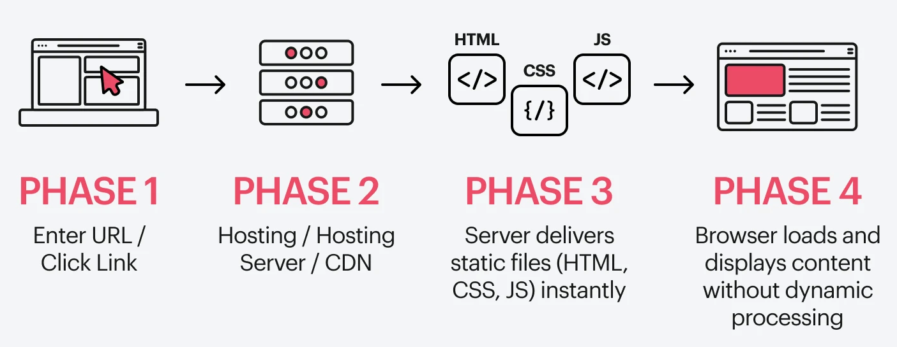

# Páginas Web Estáticas

## O que é uma Página Web "Estática"? {.allowframebreaks}

  * Uma **página web estática** é um ficheiro (ou conjunto de ficheiros) entregue ao *browser* do utilizador *exatamente* como está armazenado no servidor.
  * O conteúdo é **fixo**. Cada utilizador vê exatamente o mesmo conteúdo, independentemente de quem é ou do que faz.
  * Pense nisto como uma brochura digital ou uma página de um livro.
  * O trabalho do servidor é simples: encontrar o ficheiro (ex: `about.html`) e enviá-lo.
  * Tecnologias centrais: **HTML** (para a estrutura) e **CSS** (para o estilo).

  { width=85% }

## HyperText Markup Language {.allowframebreaks}

Vamos decompor isto:

  * **HyperText (Hipertexto):** Refere-se a texto que contém links ("hyperlinks") para outros textos (ou páginas). Este é o conceito fundamental que conecta toda a web.
  * **Markup Language (Linguagem de Marcação):** Isto *não* é uma linguagem de programação.
      * Uma **linguagem de programação** *faz* coisas (ex: `if (x > 5) { do_something() }`).
      * Uma **linguagem de marcação** *descreve* coisas. Usa "tags" (etiquetas) para definir a estrutura e o significado do conteúdo.

### Exemplo:

```html
<h1>Este é o meu título principal</h1>

<p>Isto é um bloco de texto.</p>
```

## A Evolução para HTML5 {.allowframebreaks}

### HTML Antigo (HTML4):

Só tínhamos um contentor genérico: `<div>`. Isto levava a código que era difícil de ler, tanto para programadores como para máquinas (como leitores de ecrã ou motores de busca).

```html
<div id="header">
  <div id="nav">...</div>
</div>
<div id="main-content">
  <div class="article">...</div>
</div>
<div id="footer">...</div>
```

### HTML Moderno (HTML5):

O HTML5 introduziu **tags semânticas** que descrevem o seu *significado* e *propósito*.

```html
<header>
  <nav>...</nav>
</header>
<main>
  <article>...</article>
</main>
<footer>...</footer>
```

## HTML4 vs HTML5


## Porque é que a Semântica HTML5 é Importante {.allowframebreaks}

Usar tags como `<header>`, `<main>` e `<article>` é crítico para:

1.  **Acessibilidade:**

      * Leitores de ecrã (usados por utilizadores com deficiência visual) conseguem entender a estrutura da página.
      * Podem dizer "A entrar no conteúdo principal" ou "A saltar para a navegação." Isto é impossível com tags `<div>` genéricas.

2.  **Otimização para Motores de Busca (SEO):**

      * Motores de busca (como o Google) conseguem entender melhor sobre o que é o seu conteúdo.
      * Conteúdo dentro de uma tag `<article>` é claramente um artigo. Conteúdo em `<nav>` é claramente para navegação. Isto ajuda a sua página a ser classificada (rank) corretamente.

3.  **Legibilidade para o Programador:**

      * O seu código torna-se mais limpo, mais organizado e mais fácil de manter.

## O Esqueleto Base do HTML5 {.allowframebreaks}

Todos os ficheiros HTML modernos devem ter esta estrutura básica:

```html
<!DOCTYPE html>
<html lang="pt">
<head>
    <meta charset="UTF-8"> <meta name="viewport" content="width=device-width, initial-scale=1.0">
    <title>A Minha Primeira Página Web</title> <link rel="stylesheet" href="style.css"> </head>

  <body>
    </body>

</html>
```

{ width=55% }

## Header: `<header>` {.allowframebreaks}

  * **Propósito:** Contém conteúdo introdutório para a página inteira (ou para um `<article>`).
  * **Não** confundir com a tag `<head>`\!
  * **Conteúdo Típico:** O logótipo do site, o título principal do site, barra de pesquisa e, muitas vezes, a navegação principal.

<!-- end list -->

```html
<header>
  
  <h1>O Meu Site Fantástico</h1>
  <nav>
    ...
  </nav>
</header>
```

## Navegação: `<nav>` {.allowframebreaks}

  * **Propósito:** Especificamente para "blocos de navegação principais". Use-o para a navegação principal do seu site, índice, etc.
  * **Não** o use para *todas* as listas de links (ex: links num `<footer>`).
  * É comum colocar uma lista não ordenada (`<ul>`) dentro dele.

<!-- end list -->

```html
<nav>
  <ul>
    <li><a href="/">Início</a></li>
    <li><a href="/about">Sobre</a></li>
    <li><a href="/contact">Contacto</a></li>
  </ul>
</nav>
```

## O Conteúdo Principal: `<main>` {.allowframebreaks}

  * **Propósito:** Esta tag é para o **conteúdo principal e único** da página.
  * Deve conter o "objetivo" da página (ex: o post do blog, os detalhes do produto, o texto "Sobre Nós").
  * **Regra:** Deve haver **apenas uma** tag `<main>` por página.
  * *Não* deve conter conteúdo repetido como barras laterais (sidebars), cabeçalhos (headers) ou rodapés (footers).

<!-- end list -->

```html
<body>
  <header>...</header>
  <nav>...</nav>

  <main>
    <h2>Sobre a Nossa Empresa</h2>
    <p>Fomos fundados em 2025...</p>
  </main>

  <footer>...</footer>
</body>
```

## Organizar Conteúdo: `<article>` vs. `<section>` {.allowframebreaks}

Esta é a parte mais confusa do HTML5, mas é simples:

### `<article>`

  * **Propósito:** Para uma peça de conteúdo **completa e autónoma** que poderia (em teoria) ser distribuída por si só (como um feed RSS).
  * **Teste:** Poderia imprimir *apenas* esta parte, e faria sentido?
  * **Exemplos:** Um post de blog, uma notícia, um comentário de fórum, um cartão de produto.

### `<section>`

  * **Propósito:** Para um **agrupamento temático** de conteúdo *dentro* de uma página (ou *dentro* de um artigo).
  * **Teste:** É isto um "capítulo" ou "subseção" de um todo maior?
  * **Exemplos:** Uma área "Contacte-nos", um bloco "Principais Notícias", Capítulo 1 de um artigo.

## Notas Laterais: `<aside>` {.allowframebreaks}

  * **Propósito:** Para conteúdo que está "tangencialmente relacionado" com o conteúdo à sua volta.
  * Se o removesse, o conteúdo principal continuaria a fazer todo o sentido.
  * **Uso Típico:** Uma barra lateral (sidebar).
  * **Exemplos:** Links relacionados, uma "citação de destaque" (pull quote) de um artigo, biografia do autor, publicidade.

<!-- end list -->

```html
<main>
  <article>
    <h1>O Meu Post de Blog</h1>
    <p>...o texto principal...</p>
  </article>

  <aside>
    <h3>Posts Relacionados</h3>
    <ul>
      <li><a href="...">Outro Post</a></li>
    </ul>
  </aside>
</main>
```

## O Fim: `<footer>` {.allowframebreaks}

  * **Propósito:** Representa o "rodapé" para a sua "raiz de secção" (sectioning root) mais próxima (que é geralmente o próprio `<body>`).
  * **Conteúdo Típico:** Informação de copyright, navegação secundária (política de privacidade, mapa do site), links de contacto.

<!-- end list -->

```html
<footer>
  <p>&copy; 2025 O Meu Site Fantástico</p>
  <ul>
    <li><a href="/privacy">Política de Privacidade</a></li>
    <li><a href="/sitemap">Mapa do Site</a></li>
  </ul>
</footer>
```

## Media HTML5: Imagens `` {.allowframebreaks}

  * A tag `` é usada para incorporar imagens. Isto inclui ficheiros `.jpg`, `.png`, `.svg`, e `.gif` animados.
  * É uma tag "vazia", o que significa que não tem tag de fecho.
  * **`src` (source - origem):** O caminho ou URL para o ficheiro de imagem. Isto é **obrigatório**.
  * **`alt` (alternative text - texto alternativo):** Uma descrição da imagem. Isto é **crítico** para a acessibilidade (para leitores de ecrã) e para SEO. Também será exibido se a imagem falhar ao carregar.

<!-- end list -->

```html


```

## Media HTML5: Áudio `<audio>` {.allowframebreaks}

  * Antes do HTML5, o áudio requeria plugins como o Flash. Agora é nativo\!
  * A tag `<audio>` incorpora conteúdo de som.
  * **`controls`:** Este atributo booleano adiciona os controlos padrão do browser (play/pause/volume). **Deve incluí-lo sempre.**
  * **Tag `<source>`:** Pode fornecer múltiplos formatos de ficheiro. O browser irá tocar o *primeiro* que suportar. Isto é crucial para a compatibilidade entre browsers.

<!-- end list -->

```html
<audio controls src="music/my-song.mp3">
  O seu browser não suporta o elemento de áudio.
</audio>

<audio controls>
  <source src="music/my-song.ogg" type="audio/ogg">
  <source src="music/my-song.mp3" type="audio/mpeg">
  O seu browser não suporta o elemento de áudio.
</audio>
```

## Media HTML5: Vídeo `<video>` {.allowframebreaks}

  * Tal como o `<audio>`, a tag `<video>` substituiu o Flash para conteúdo de vídeo.
  * **`controls`:** Novamente, isto adiciona os controlos padrão de play/pause/ecrã inteiro.
  * **`width` / `height`:** Pode definir as dimensões do leitor de vídeo.
  * **Tag `<source>`:** Tal como no áudio, esta é a boa prática para fornecer múltiplos formatos de vídeo (como `.mp4` e `.webm`) para suportar todos os browsers.

<!-- end list -->

```html
<video controls width="640" height="480" src="movies/my-video.mp4">
  O seu browser não suporta a tag de vídeo.
</video>

<video controls width="640" height="480">
  <source src="movies/my-video.webm" type="video/webm">
  <source src="movies/my-video.mp4" type="video/mp4">
  O seu browser não suporta a tag de vídeo.
</video>
```

## Juntar Tudo {.allowframebreaks}

```html
<!DOCTYPE html>
<html lang="pt">
<head>
  <title>A Minha Página Semântica</title>
  <link rel="stylesheet" href="style.css">
</head>
<body>

  <header>
    <h1>O Meu Site</h1>
    <nav>
      <ul>
        <li><a href="/">Início</a></li>
        <li><a href="/blog">Blog</a></li>
      </ul>
    </nav>
  </header>

  <main>
    <article>
      <h2>O Meu Primeiro Post de Blog</h2>
      <p>Este é o texto principal do meu post.</p>
      <figure>
        
        <figcaption>Isto é uma legenda de imagem.</figcaption>
      </figure>

      <section>
        <h3>Parte 1</h3>
        <p>A primeira parte do post.</p>
      </section>
    </article>
  </main>

  <aside>
    <h3>Sobre o Autor</h3>
    <p>Eu adoro escrever posts de blog.</p>
  </aside>

  <footer>
    <p>&copy; 2025 O Meu Site</p>
  </footer>

</body>
</html>
```

# CSS

## O que é o CSS?

  * **C**ascading **S**tyle **S**heets.
  * CSS fornece o **estilo** (a "pele") para o seu HTML (o "esqueleto").
  * Controla cores, tipos de letra (fontes), layout, espaçamento e animações.
  * HTML e CSS são linguagens **separadas**. Este é um princípio central chamado **Separação de Preocupações** (Separation of Concerns).
      * HTML é para *conteúdo e estrutura*.
      * CSS é para *apresentação*.

## O "C": Cascata (Cascading)

  * "Cascata" refere-se ao conjunto de regras que determina qual o estilo aplicado se múltiplas regras entrarem em conflito.
  * **A Cascata (simplificado):**
    1.  **Origem:** Estilos da folha de estilos de um programador (o seu `style.css`) sobrepõem-se aos estilos padrão do browser.
    2.  **Especificidade:** Um seletor mais *específico* ganha. `#my-id` é mais específico que `.my-class`, que é mais específico que `p`.
    3.  **Ordem no Ficheiro:** Se dois seletores tiverem a *mesma* especificidade, o que aparece **por último** no ficheiro ganha.

<!-- end list -->

```css
/* style.css */
p { color: blue; }
p { color: red; } /* Este ganha (Ordem no Ficheiro) */

.my-p { color: green; }
p { color: purple; } /* .my-p é mais específico, por isso o verde ganha! */
```

## O "S": Seletores & Propriedades (Selectors & Properties) {.allowframebreaks}

  * CSS funciona num modelo simples de "Seletor + Declaração".

<!-- end list -->

```css
/* Seletor      Bloco de Declaração  */
/* |           |--| */
    h1 {
/* Propriedade  Valor   */
/* |          |      */
      color: blue;
      font-size: 24px;
    }
/* |-| */
/* Isto tudo é um "Conjunto de Regras" (Ruleset) */
```

  * **Seletores (O "Quem"):**
      * **Elemento:** `p` (seleciona todas as tags `<p>`)
      * **Classe:** `.my-class` (seleciona todas as tags com `class="my-class"`)
      * **ID:** `#my-id` (seleciona a *única* tag com `id="my-id"`)

## Métodos de Integração {.allowframebreaks}

### Externo (Boa Prática)

  * Escreve todo o seu CSS num ficheiro `style.css` separado.
  * Liga-o no `<head>` do HTML.
  * **Prós:**
      * **Reutilizável:** Um ficheiro CSS pode estilizar 1000 páginas HTML.
      * **Manutenível:** Para mudar a cor do site, edita *um* ficheiro.
      * **Caching:** O browser descarrega o `style.css` uma vez e guarda-o (cache), fazendo com que outras páginas carreguem mais rápido.

<!-- end list -->

```html
<link rel="stylesheet" href="styles.css">
```

### Interno / Incorporado (Embedded)

  * Escreve o seu CSS dentro de uma tag `<style>` diretamente no `<head>` do HTML.
  * **Prós:**
      * Útil para demonstrações de página única ou testes rápidos.
  * **Contras:**
      * Afeta apenas este *único* ficheiro HTML.
      * Não pode ser guardado em cache separadamente.
      * Torna o ficheiro HTML grande e desarrumado.

<!-- end list -->

```html
<style>
  body {
    background-color: #f0f0f0;
  }
  h1 {
    color: teal;
  }
</style>
```

-----

### Em Linha (Inline - Evitar\!)

  * Escreve CSS diretamente dentro do atributo `style` de uma tag HTML.
  * Isto mistura conteúdo e estilo, violando a "Separação de Preocupações".
  * **Contras:**
      * Extremamente difícil de manter.
      * Especificidade mais alta possível (ela "ganha" contra todos os outros estilos), o que causa problemas difíceis de depurar (debug).
      * "Desarruma" (polui) o seu HTML.

<!-- end list -->

```html
<p style="color: red; font-size: 12px;">
  Isto é um parágrafo.
</p>
```

# Páginas Estáticas vs. Dinâmicas

## Estático (HTML/CSS) - "A Brochura"

  * **Trabalho do Servidor:** Encontrar o ficheiro pedido (ex: `about.html`) e enviá-lo.
  * **Trabalho do Cliente (Browser):** Receber o ficheiro e renderizá-lo.
  * O conteúdo é **fixo**.

## Dinâmico (JS) - "A Aplicação"

  * **Trabalho do Servidor:** Enviar um ficheiro HTML *base* (shell) e um pacote (bundle) de JavaScript (`app.js`).
  * **Trabalho do Cliente (Browser):**
    1.  Recebe o HTML base.
    2.  Recebe e *executa* o ficheiro `app.js`.
    3.  O JavaScript **manipula o DOM** (Document Object Model) para construir a página, mostrar/esconder elementos e criar interatividade.
    4.  É assim que o React, Angular e Vue funcionam.

## Dinâmica do Lado do Cliente: `fetch()`

  * O JavaScript torna uma página "dinâmica" possível ao ir buscar (fetch) dados *depois* da página ter carregado.
  * Usa a API `fetch()` (isto costumava ser chamado de AJAX).
  * **Modelo:** Isto é um modelo **Pedido-Resposta** (Request-Response) (ou "Pull").

**Fluxo:**

1.  O utilizador clica num botão "Carregar Posts".
2.  O JavaScript executa: `fetch('/api/posts')`
3.  O browser envia um *novo* pedido HTTP ao servidor.
4.  O servidor envia de volta *apenas* dados (normalmente em formato **JSON**).
5.  O JavaScript recebe o JSON, itera sobre ele (loops) e cria novo HTML para exibir os posts.

<!-- end list -->

  * **Ideia Chave:** O conteúdo da página muda *sem um recarregamento (reload) completo da página*.

## O Limite do `fetch()`: Polling

  * O `fetch()` é ótimo, mas é "iniciado pelo cliente". O cliente tem de *pedir* os dados.
  * **Problema:** Como é que se constrói uma aplicação de chat em tempo real?
  * **Má Solução (Polling):** O cliente tem de perguntar ao servidor a cada 2 segundos, "Há mensagens novas? ... Há mensagens novas? ... Há mensagens novas?"
  * Isto é *altamente* ineficiente e inunda o seu servidor com pedidos.

## Dinâmica em Tempo Real: WebSockets {.allowframebreaks}

  * **A Solução:** WebSockets.
  * Um WebSocket *não* é um "pedido". É uma **ligação persistente e bidirecional** (como uma chamada telefónica).
  * **Fluxo:**
    1.  O cliente envia um pedido especial de "Upgrade" ao servidor.
    2.  O servidor aceita, e a ligação é "atualizada" (upgraded) de HTTP para um WebSocket (`ws://` ou `wss://`).
    3.  Esta ligação *permanece aberta*.
  * Agora, o **servidor pode *empurrar* (push) dados** para o cliente a qualquer momento, instantaneamente.
  * **Exemplo de App de Chat:**
    1.  Utilizador A envia uma mensagem.
    2.  O servidor recebe-a (via WebSocket).
    3.  O servidor *empurra* (push) essa mensagem para o Utilizador B (através do WebSocket dele).
    4.  A mensagem aparece no ecrã do Utilizador B instantaneamente. Não é preciso polling.

## Dinâmica em Tempo Real: MQTT

  * Também poderão ouvir falar de **MQTT** (Message Queuing Telemetry Transport).
  * Isto *não* é uma tecnologia nativa do browser como os WebSockets.
  * É um protocolo **publicar/subscrever (pub/sub)** extremamente leve, popular para dispositivos **IoT** (Internet das Coisas).
  * **Modelo Pub/Sub:**
      * Um dispositivo "publica" uma mensagem num "tópico" (ex: `casa/sala_de_estar/temperatura`).
      * Qualquer outro dispositivo "subscrito" a esse tópico recebe a mensagem instantaneamente.
  * **Como se relaciona com a web:** Pode usar-se um servidor (um "broker") que faz a *ponte* (bridge) de MQTT para WebSockets, permitindo que um dashboard web (no seu browser) subscreva tópicos e obtenha atualizações em tempo real de dispositivos IoT.

# Acesso HTML & Publicação

## Como é que um Browser Acede *Realmente* a uma Página {.allowframebreaks}

Um processo detalhado de 13 passos:

1.  **Escreve `http://example.com`** e prime Enter.

2.  **Browser:** "Qual é o endereço IP para `example.com`?" Verifica a sua cache local.

3.  **SO (Sistema Operativo):** O browser não sabia. O Sistema Operativo verifica a *sua* cache (ex: ficheiro `hosts`).

4.  **Resolvedor DNS:** O SO não sabia. O pedido vai para um Resolvedor DNS (ex: o seu router, ou 8.8.8.8). O resolvedor encontra o endereço IP (ex: `93.184.216.34`) para `example.com`.

5.  **Handshake TCP:** O browser agora sabe o IP. Abre uma ligação TCP (um "socket") para `93.184.216.34` na **porta 80** (para HTTP) ou **porta 443** (para HTTPS). Isto envolve um "three-way handshake" (SYN, SYN-ACK, ACK).

6.  **Pedido HTTP:** Assim que a ligação está aberta, o browser envia um pedido HTTP em texto simples:

    ```
    GET / HTTP/1.1
    Host: example.com
    User-Agent: Mozilla/5.0 (Windows NT 10.0; ...)
    Accept: text/html,...
    ```

7.  **O Pedido Chega ao Seu Servidor:** O pedido chega ao IP do servidor (`93.184.216.34`).

8.  **A Parte do Docker:**

      * O seu `docker-compose.yml` mapeou a porta 80 da máquina anfitriã (host) para a porta 80 no **contentor Nginx**.
      * A camada de rede (networking) do Docker encaminha instantaneamente este pacote de pedido para dentro do contentor.

9.  **A Parte do Nginx:**

      * O Nginx (a correr no contentor) recebe o pedido `GET /`.
      * Verifica a sua configuração (ex: `nginx.conf`).
      * Vê que deve servir ficheiros do seu diretório `root`, que é `/usr/share/nginx/html`.
      * Graças à **montagem de volume** (volume mount) do seu `docker-compose.yml` (`./my-html-folder:/usr/share/nginx/html`), quando o Nginx procura na sua pasta *do contentor*, está *na verdade* a ler da pasta da *sua máquina anfitriã (host)*.
      * O Nginx encontra o ficheiro `index.html`.

10. **Resposta HTTP:** O Nginx envia uma resposta HTTP em texto simples de volta pela mesma ligação TCP:

    ```
    HTTP/1.1 200 OK
    Content-Type: text/html
    Content-Length: 1234

    <!DOCTYPE html>... (o seu ficheiro HTML inteiro)
    ```

11. **Análise (Parsing) do Browser:** O browser recebe este HTML. Começa a lê-lo de cima a baixo.

12. **Pedidos Subsequentes:** O browser lê o `<head>` e encontra:
    `<link rel="stylesheet" href="style.css">`

      * **Pausa a análise (parsing)** e volta ao **Passo 5** para fazer um *pedido HTTP totalmente novo* para ir buscar o `style.css`.
      * Faz o mesmo para ``, `<script src="...">`, etc.

13. **Renderizar:** Assim que todos os ficheiros são obtidos, o browser "pinta" a página no seu ecrã.

## Exemplo Nginx + Docker Compose {.allowframebreaks}

Este ficheiro `docker-compose.yml` é a receita para o seu servidor nos Passos 8-9.

```yaml
# docker-compose.yml
version: '3.8'

services:
  # 'webserver' é apenas um nome que escolhemos
  webserver:
    # Usar a imagem oficial e leve (lightweight) do Nginx
    image: nginx:alpine

    # Mapear [Porta Host]:[Porta Contentor]
    # "Qualquer tráfego na porta 8080 da minha máquina...
    # ...deve ser enviado para a porta 80 deste contentor"
    ports:
      - "8080:80"

    # Montar [Pasta Host]:[Pasta Contentor]
    # "Fazer com que a minha pasta local './my-site'...
    # ...apareça dentro do contentor em '/usr/share/nginx/html'"
    volumes:
      - ./my-site:/usr/share/nginx/html:ro

    # ':ro' significa 'read-only' (apenas leitura), uma boa prática de segurança.
```

  * **Para Executar:** `docker compose up`
  * **Para Aceder:** `http://localhost:8080`

# O Reverse Proxy

## Um Proxy (Direto - Forward) {.allowframebreaks}

Primeiro, vamos definir um "proxy direto" (forward proxy), que pode usar na escola ou no trabalho.

  * **Esconde o Cliente.**
  * Você (cliente) -\> Proxy -\> Internet
  * A Internet (ex: Google) vê o pedido a vir do *IP do Proxy*, não do seu.
  * O seu propósito é filtrar/monitorizar o *seu* tráfego.

## Um Reverse Proxy

Um **reverse proxy** é o oposto.

  * **Esconde o(s) Servidor(es).**
  * Internet (cliente) -\> Reverse Proxy -\> Servidores da Sua App
  * Você (o cliente) apenas sabe o IP do reverse proxy. Não faz *a mínima ideia* de que servidores estão a correr por trás dele.
  * Este é o padrão para *todas* as aplicações web modernas.

## Porque Usar um Reverse Proxy? {.allowframebreaks}

Um reverse proxy (como o Nginx) é um "polícia de trânsito" (traffic cop) que fornece:

1.  **Roteamento de Pedidos (Request Routing):**

      * Pode olhar para o URL e enviar o pedido para diferentes servidores *internos*.
      * `example.com/` -\> vai para o seu contentor `frontend-app`.
      * `example.com/api/` -\> vai para o seu contentor `backend-api`.

2.  **Balanceamento de Carga (Load Balancing):**

      * E se o seu backend estiver demasiado ocupado? Pode correr 10 cópias dele.
      * O reverse proxy irá *distribuir* o tráfego entre todas as 10 cópias ("balanceamento de carga") para que nenhum servidor fique sobrecarregado.

3.  **Terminação SSL (SSL Termination):**

      * Lidar com HTTPS (encriptação) é computacionalmente dispendioso.
      * Deixe o reverse proxy fazer todo o trabalho pesado de encriptar/desencriptar (isto é "terminação SSL").
      * Por trás do proxy, as suas apps internas podem comunicar usando HTTP simples e rápido.

4.  **Caching:**

      * O proxy pode guardar cópias de ficheiros estáticos (imagens, CSS) e servi-los diretamente, reduzindo a carga nos seus servidores de aplicação.

## Reverse Proxy: Exemplo Docker Compose

Este `docker-compose.yml` tem 3 serviços. **Apenas o proxy é público.**

```yaml
version: '3.8'
services:
  # 1. O Reverse Proxy (Público)
  proxy:
    image: nginx:alpine
    ports:
      - "80:80" # Esta é a ÚNICA porta pública
    volumes:
      # Damos-lhe um ficheiro de configuração personalizado
      - ./nginx.conf:/etc/nginx/nginx.conf:ro
  # 2. A App Frontend (Privada)
  frontend:
    image: my-frontend-app # A sua app React/Vue/etc
    # SEM portas. Está escondida.
  # 3. A API Backend (Privada)
  backend:
    image: my-backend-api # A sua API Python/Node/Java
    # SEM portas. Está escondida.
```

## Reverse Proxy: Exemplo de Configuração Nginx

Este é o ficheiro `nginx.conf` que diz ao proxy como encaminhar o tráfego.

```nginx
# nginx.conf
events {}
http {
  server {
    listen 80; # Escutar na porta pública 80

    # Regra 1: Se o URL for /api/...
    location /api/ {
      # Passar o pedido para o serviço 'backend'
      # (O DNS interno do Docker resolve 'backend' para o IP do contentor)
      proxy_pass http://backend:5000; # Assumindo que a API corre na porta 5000
    }

    # Regra 2: Para tudo o resto (/)
    location / {
      # Passar o pedido para o serviço 'frontend'
      proxy_pass http://frontend:3000; # Assumindo que o frontend corre na porta 3000
    }
  }
}
```

# CORS

## O que é o CORS?

### O Problema: Política de Mesma Origem (Same-Origin Policy - SOP)

  * Esta é uma **funcionalidade de segurança crítica** incorporada em *todos* os browsers modernos.
  * Dita que: Um script numa página web só pode fazer pedidos para **a *mesma origem* de onde foi carregado.**
  * **O que é uma "Origem"?**
      * `Protocolo` + `Domínio` + `Porta`
      * `http://example.com:80` e `https://example.com:443` são origens **DIFERENTES** (Protocolo).
      * `http://site.com` e `http://api.site.com` são origens **DIFERENTES** (Domínio).
      * `http://localhost:3000` e `http://localhost:5000` são origens **DIFERENTES** (Porta).

## Porque é que a SOP existe?

Para impedir que `http://evil.com` (que visitou) use JavaScript para fazer um pedido `fetch()` para `http://meu-banco.com` (onde tem sessão iniciada) e roube o seu dinheiro.

## A Solução: CORS {.allowframebreaks}

  * **C**ross-**O**rigin **R**esource **S**haring (Partilha de Recursos de Origem Cruzada)
  * A SOP é boa, mas *também* bloqueia o nosso `http://localhost:3000` (frontend) *legítimo* de falar com o `http://localhost:5000` (backend).
  * **CORS** é o mecanismo para *relaxar* a SOP.
  * **Não** é uma definição no browser. É um conjunto de **cabeçalhos (headers) HTTP** que o **SERVIDOR** envia de volta para o browser.
  * Ao enviar estes cabeçalhos, o servidor diz ao browser: "Está tudo bem, eu dou permissão a *essa origem específica* para aceder aos meus recursos."

-----

### Exemplo:

1.  Frontend (`localhost:3000`) faz `fetch('http://localhost:5000/api/users')`.
2.  O browser vê que é um pedido "cross-origin" (de origem cruzada) e pausa-o.
3.  O browser envia um pedido "preflight" `OPTIONS` para `http://localhost:5000`.
4.  O seu **servidor backend** tem de responder com os cabeçalhos de "permissão":
    ```
    HTTP/1.1 204 No Content
    Access-Control-Allow-Origin: http://localhost:3000
    Access-Control-Allow-Methods: GET, POST, OPTIONS
    Access-Control-Allow-Headers: Content-Type
    ```
5.  O browser vê isto, diz "OK, permissão concedida", e envia o pedido `GET` *real*.

## Mais Recursos

  * **W3Schools:**

      * Um ótimo site para tutoriais práticos e exemplos.
      * [https://www.w3schools.com/](https://www.w3schools.com/)

  * **MDN (Mozilla Developer Network):**

      * O melhor recurso único para aprender e consultar HTML, CSS e JS.
      * [developer.mozilla.org](https://developer.mozilla.org)

  * **Nginx & Docker Docs:**

      * A documentação oficial é a sua melhor amiga.
      * [docs.docker.com](https://docs.docker.com)
      * [nginx.org/en/docs](https://nginx.org/en/docs/)
