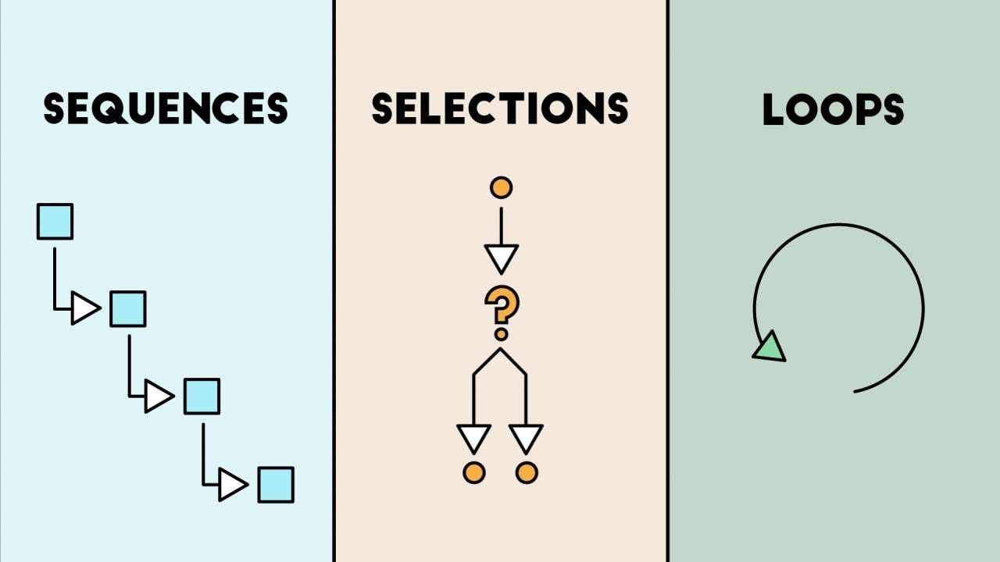

# JavaScript

## JavaScript: Detailed Overview {.allowframebreaks}

JavaScript (JS) is often misunderstood as a "scripting toy," but it is a sophisticated, high-level language.

**1. Dynamic Typing & Weak Typing**

* Variables are not bound to a specific *data type.*
* *Why this matters:* You can assign a Number to a variable, and later assign a String to the same variable. This offers flexibility but increases the risk of runtime errors (e.g., trying to multiply a string).

```javascript
let x = 42;
x = "hello";
console.log(x)
```

**2. Prototype-based Object Orientation**

* *How it works:* Unlike Class-based languages (Java/C++) where objects are instantiated from "blueprints" (classes), JS objects inherit directly from other objects (prototypes).
* *Implication:* Memory efficiency involves cloning existing structures rather than defining rigid hierarchies.

```javascript
let person  = {
  eats: true,
  hasLegs: 2,
  walks(){ console.log('I can walk')}
}
//define another object
let man = {
  hasBreast: false,
  hasBeard : true,
}
//set the prototype of man to person object
man.__proto__ = person;
//define a third object
let samuel = {
   age: 23
}
//set the prototype of samuel to man
samuel.__proto__ = man;
//access walk method from samuel
console.log(samuel.walks())
//access hasBeard from samuel
console.log(samuel.hasBeard)
```

**3. Single-Threaded Execution**

* *The Constraint:* JS has a **single Call Stack**. It can only do *one thing at a time*.
* *The Risk:* If you run a heavy mathematical loop (e.g., calculating Pi to a billion digits), the entire browser tab freezes (UI blocking) because the thread is busy.

# Programming Paradigms

## Sequential Programming (Procedural) {.allowframebreaks}

This is the model used in basic C, Fortran, or simple Python scripts.

**The Logic:**

1.  The program starts.
2.  Line 1 executes.
3.  Line 2 executes.
4.  **Line 3 asks for input (`scanf`, `input()`).**
5.  The program **HALTS** (blocks) and waits for the user. Nothing else happens until the user hits Enter.

**Why this fails for UI:**
In a web interface, we cannot **"halt"** the rendering engine to wait for a mouse click. If we did, buttons wouldn't animate, and gifs wouldn't play.


## Event-Driven Programming {.allowframebreaks}

Modern interfaces (Web, Windows, macOS) use an **Event-Driven** architecture.

**The Logic:**
1.  The program starts (Initialization).
2.  It defines "Handlers" (functions waiting for specific triggers).
3.  It enters the **Event Loop**.
4.  The program sits in a **Listening State**.

**The "Hollywood Principle":**
* *Don't call us, we'll call you.*
* The code doesn't ask "Did the user click?". Instead, the browser interrupts the code saying "A click just happened, run the Click Function."
{ width=65% }

## The Chain of Events {.allowframebreaks}

How does a physical action become code execution?

1.  **Hardware Level:** User moves the mouse. The mouse hardware sends an electrical signal (interrupt) to the CPU.
2.  **OS Level:** The Operating System (Windows/Linux) interprets this signal as a coordinate change and paints the cursor moving.
3.  **Browser Level:** The browser window sees the cursor is over a specific HTML button and the mouse button was pressed.
4.  **The Event:** The browser creates a JavaScript `Event` Object containing details (X/Y coordinates, which button, timestamps).
5.  **The Listener:** The browser checks: *Does this HTML element have a listener attached?*
6.  **Execution:** If yes, the registered JS function is pushed to the execution stack.

# JavaScript in the Webpage

## The Document Object Model (DOM)

**The Concept:**
When you write an HTML file, it is just a text string. The browser parses this string into a structure in memory called the DOM.

* **HTML:** `<div id="app"></div>` (Text on hard drive)
* **DOM:** `HTMLDivElement` (Object in RAM)

**Why JS uses the DOM:**
JavaScript cannot edit the text file on the server. It edits the **Object in RAM**. The browser's rendering engine constantly watches the DOM; when JS updates the DOM object, the browser repaints the screen.

## Execution & Loading Strategies {.allowframebreaks}

HTML is parsed sequentially (top to bottom). When the parser sees a `<script>` tag, it pauses HTML parsing to download and run the script. This creates issues:

**1. The "Bottom of Body" Hack**

* *Technique:* Putting `<script>` just before `</body>`.
* *Reasoning:* Ensures all HTML elements exist in the DOM before the script tries to find them.

**2. The `defer` Attribute (Modern Standard)**

```html
<script src="app.js" defer></script>
```

* *Behavior:* The script downloads in the background (parallel) while HTML parses.
* *Execution:* The browser guarantees the script will only run **after** the HTML is fully parsed but **before** the `DOMContentLoaded` event.
* *Benefit:* Faster page load times and safe DOM access.

## The Event Loop (Technical Detail) {.allowframebreaks}

How does single-threaded JS handle asynchronous tasks (like fetching data) without freezing?

1.  **Call Stack:** Runs synchronous code (LIFO).
2.  **Web APIs:** When you call `setTimeout` or `fetch`, the "work" is offloaded to the Browser's C++ threads (not the JS thread).
3.  **Callback Queue:** When the Web API is done, it puts your callback function into a Queue.
4.  **The Loop:** The Event Loop checks: *"Is the Stack empty?"*
      * If **NO**: Wait.
      * If **YES**: Move the first item from the Queue to the Stack.

*This is why `setTimeout(fn, 0)` doesn't run immediately—it waits for the stack to clear.*

# JS Examples

## 1. Handling Mouse Events {.allowframebreaks}

We use `addEventListener`. This is the registration phase of Event-Driven programming.

```javascript
const box = document.querySelector('#box');
// The 'event' object is automatically passed by the browser
function handleMove(event) {
    // Update text with mouse coordinates
    box.textContent = `X: ${event.clientX}, Y: ${event.clientY}`;
    // Dynamic styling based on logic
    if (event.clientX > 500) {
        box.style.backgroundColor = 'red';
    } else {
        box.style.backgroundColor = 'blue';
    }
}
// Subscribe to the 'mousemove' event
box.addEventListener('mousemove', handleMove);
```

## 2. Dynamic Content (Photo Library) {.allowframebreaks}

We can create the interface programmatically. This is how React/Vue work under the hood (Imperative approach).

```javascript
const urls = ['img1.jpg', 'img2.jpg'];
const container = document.getElementById('gallery');

urls.forEach(url => {
    // 1. Create Element: Creates an orphan object in memory
    const img = document.createElement('img');
    // 2. Configure Object: Set properties
    img.src = url;
    img.className = 'thumbnail';
    // 3. Attach Event: Make it interactive immediately
    img.addEventListener('click', () => {
        console.log("You clicked " + url);
    });
    // 4. Mount: Insert into the live DOM tree.
    container.appendChild(img);
});
```

## 3. Asynchronous Data (Fetch API) {.allowframebreaks}

Fetching data from an API takes time (latency). We use **Promises** (`async/await`) to prevent blocking.

```javascript
async function getData() {
    try {
        // 'await' yields the thread until the Promise resolves.
        // The UI remains responsive during this pause.
        const response = await fetch('[https://api.data.gov/users](https://api.data.gov/users)');
        // Parsing JSON is also asynchronous (it handles streams)
        const data = await response.json();
        console.log(data); // Runs only after network finishes
    } catch (error) {
        // Handles network failures (404, 500, Offline)
        console.error("Fetch failed:", error);
    }
}
```

## 4. Real-Time Communication (WebSockets) {.allowframebreaks}

**HTTP vs. WebSockets:**

  * **HTTP:** Client asks, Server answers, Connection closes. (Stateless).
  * **WebSocket:** Client performs a "Handshake", Connection upgrades to TCP socket, Connection stays open.

```javascript
const socket = new WebSocket('ws://localhost:8080');
// Event: Connection Established
socket.onopen = () => {
    console.log("Connected to Chat Server");
    socket.send("User joined");
};
// Event: Server pushed data to us
socket.onmessage = (event) => {
    // This fires whenever the server sends data. No polling!
    const message = JSON.parse(event.data);
    displayMessage(message);
};
```

# Debugging in the Browser

## The Challenge of Interpreted Languages {.allowframebreaks}

Unlike C, C++, or Rust, JavaScript is an **Interpreted** (or JIT compiled) language.

**Compiled Languages (C/C++):**

*   The compiler scans the entire code **before** execution.
*   Syntax errors and type mismatches are caught at **Compile Time**.
*   *Result:* You cannot run the program until these errors are fixed.

**Interpreted Languages (JavaScript):**

*   The browser reads and executes code line-by-line (or block-by-block) at **Runtime**.
*   *Result:* The application might load perfectly and run for minutes.
*   **The Crash:** The error only occurs when the execution flow hits the specific buggy line (e.g., when a user clicks a specific button).

**Consequence:**
"It works on my machine" is common. You might not encounter the error because you didn't trigger the specific execution path that contains the bug.

## The Environment Gap: Editor vs. Browser {.allowframebreaks}

Debugging Web Applications introduces a disconnect between where you **write** code and where you **run** code.

**1. The Context Switch:**
*   You write code in an **IDE** (VS Code), which has static analysis and linting.
*   You run code in the **Browser** (Chrome/Firefox).
*   When an error occurs, it appears in the Browser's Console, not immediately in your text editor.

**2. The "Black Box" Problem:**
*   The browser often runs "minified" or "bundled" code (to save bandwidth).
*   An error on line 1 of `bundle.js` is useless to the developer.
*   *Solution:* We rely on **Source Maps**, which tell the browser how to map the running code back to your original files.

## Debugging Strategies

**1. "Printf" Debugging (`console.log`)**
*   The oldest method. You print variables to the browser console to inspect the state.
*   *Pros:* Fast, simple.
*   *Cons:* Clutters code, requires cleanup, doesn't pause execution.

**2. The `debugger;` Keyword**
*   Placing the statement `debugger;` in your code forces the browser to **pause execution** (breakpoint) at that line.
*   You can then step through code line-by-line.

**3. Browser DevTools (The Sources Tab)**
*   Modern browsers (Chrome/Firefox) have built-in debuggers that rival desktop IDEs.
*   You can set breakpoints, watch variables, and inspect the Call Stack directly in the browser.

# Modern Frontend Frameworks

## The "State vs. View" Problem {.allowframebreaks}

In complex apps (e.g., Facebook, Spotify), keeping the UI (View) in sync with the data (State) using Vanilla JS is error-prone.

**Frameworks solve this by:**

1.  **Declarative Programming:** You define *what* the UI should look like for a given state, not *how* to update it.
2.  **Componentization:** Breaking the UI into reusable, isolated chunks.

## React: The Library {.allowframebreaks}

Developed by Facebook (Meta). React is technically a **Library**, not a Framework, focused solely on the View layer.

**Key Concepts:**

1.  **Virtual DOM:** React keeps a lightweight copy of the DOM in memory. When state changes, it calculates the "diff" and updates only the changed parts of the real DOM.
2.  **JSX (JavaScript XML):** Syntax extension allowing HTML to be written inside JS.
3.  **Unidirectional Data Flow:** Data flows down (Parent -\> Child).

## React Example {.allowframebreaks}

Note the **Declarative** nature. We don't call `appendChild`. We return the structure we want.

```javascript
import React, { useState } from 'react';
function ImageGallery() {
  // State Hook: When 'images' changes, the UI auto-updates
  const [images, setImages] = useState([
    { id: 1, url: 'img1.jpg' }
  ]);
  return (
    <div id="gallery">
      {/* Loop inside JSX */}
      {images.map(img => (
        
      ))}
    </div>
  );
}
```

## Angular: The Framework {.allowframebreaks}

Developed by Google. Angular is a full-fledged **Framework**. It includes routing, HTTP clients, and form handling out of the box.

**Key Concepts:**

1.  **TypeScript:** Mandatory. Adds static typing (Interfaces, Classes) to JS for safety.
2.  **Dependency Injection (DI):** Built-in system to manage services and state.
3.  **Two-Way Data Binding:** Changes in UI update State; Changes in State update UI (automatically).
4.  **Real DOM:** Angular operates directly on the DOM but uses a sophisticated Change Detection mechanism (Zones).

## Angular Example {.allowframebreaks}

Angular separates the Logic (Typescript) from the View (HTML Template).

**Component Logic (`gallery.component.ts`)**

```typescript
import { Component } from '@angular/core';
@Component({
  selector: 'app-gallery',
  templateUrl: './gallery.component.html'
})
export class GalleryComponent {
  // Typed Array
  images: Array<{url: string}> = [{ url: 'img1.jpg' }];
}
```

**Template (`gallery.component.html`)**

```html
<div id="gallery">
  <!-- Structural Directive (*ngFor) -->
  
</div>
```

## Summary Comparison {.allowframebreaks}

| Feature | **Vanilla JS** | **React** | **Angular** |
| :--- | :--- | :--- | :--- |
| **Paradigm** | Imperative | Declarative | Declarative |
| **Language** | JavaScript | JS + JSX | TypeScript |
| **DOM** | Direct Access | Virtual DOM | Real DOM + Zones |
| **Scale** | Small scripts | Medium/Large Apps | Enterprise Apps |
| **Learning Curve** | Low | Medium | High |

# Backends

## Node.js & NPM {.allowframebreaks}

**Node.js** is not a language; it is a **Runtime Environment**. It takes Chrome's V8 Engine and adds C++ bindings for File System (FS) and Networking, allowing JS to run on servers.

**NPM (Node Package Manager):**

  * Manages dependencies (libraries).
  * **`package.json`**: The project manifest. Lists what libraries are needed (`dependencies`) and how to run the project (`scripts`).

## Simple Express Server {.allowframebreaks}

Express is the standard framework for Node. It simplifies routing.

```javascript
// Import express library
const express = require('express');
const cors = require('cors'); // Middleware for Security
const app = express();
// Enable CORS: Allows our browser-based JS (from a different origin)
// to fetch data from this server. Without this, the browser blocks it.
app.use(cors());
// Define a Route (Endpoint)
app.get('/api/hello', (req, res) => {
    // Send JSON response
    res.json({
        msg: "Hello World",
        serverTime: Date.now()
    });
});
app.listen(3000, () => console.log("Running on port 3000"));
```

## Python for Web Services {.allowframebreaks}

While Node.js shares a language with the frontend, **Python** is dominant in Data Science and AI.

**FastAPI Features:**

1.  **Asynchronous:** Uses Python's `async def` (ASGI standard), making it much faster than Flask/Django.
2.  **Type Hints:** Validates data automatically.
3.  **Swagger UI:** Generates a documentation website (`/docs`) for your API automatically.

## FastAPI Example {.allowframebreaks}

```python
from fastapi import FastAPI
from fastapi.middleware.cors import CORSMiddleware

app = FastAPI()

# CORS Configuration
# Explicitly allowing the frontend container/origin
app.add_middleware(
    CORSMiddleware,
    allow_origins=["*"], # In prod, replace * with specific domain
    allow_methods=["*"],
)

@app.get("/api/items")
async def read_items():
    # Python Dictionary is automatically converted to JSON
    return [
        {"name": "Item 1", "price": 10.5},
        {"name": "Item 2", "price": 20.0}
    ]
```

## The Architecture {.allowframebreaks}

We have two separate applications:

1.  **Frontend:** Static HTML/JS served by Nginx (or a built React/Angular app).
2.  **Backend:** Python/Node API processing data.

We need to run them together and ensure they can communicate.

## Docker Compose Configuration {.allowframebreaks}

`docker-compose.yml` orchestrates multi-container applications.

```yaml
services:
  # --- THE BACKEND ---
  backend-api:
    build: ./backend_folder       # Build image from Dockerfile
    container_name: py_api
    ports:
      - "8000:8000"               # Expose port 8000 to host
    volumes:
      - ./backend_folder:/app     # Hot-reload code changes

  # --- THE FRONTEND ---
  frontend-web:
    image: nginx:alpine           # Use pre-built Nginx
    container_name: my_website
    ports:
      - "8080:80"                 # Browser hits localhost:8080
    volumes:
      # Inject our HTML/JS (or React build) into Nginx
      - ./frontend_folder:/usr/share/nginx/html
    depends_on:
      - backend-api               # Wait for API to start
```

**Critical Networking Concept:**

  * **Browser to Backend:** When your JavaScript runs in the *browser*, it is running on the *User's Machine*. Therefore, the JS `fetch` URL must point to `http://localhost:8000` (the port exposed by Docker to the host machine), not the internal container name.

## Additional Resources {.allowframebreaks}

**JavaScript & The Web**
* [MDN Web Docs (Mozilla)](https://developer.mozilla.org/en-US/) - The bible of web development.
* [JavaScript.info](https://javascript.info/) - Deep dive into the modern language.
* [What the heck is the event loop anyway?](https://www.youtube.com/watch?v=8aGhZQkoFbQ) (Philip Roberts) - Essential visualization of the JS runtime.

**Frameworks**
* [React Documentation](https://react.dev/) - Official docs (newly rewritten).
* [Angular University](https://angular-university.io/) - Comprehensive tutorials for Angular.

**Backend & DevOps**
* [Node.js Best Practices](https://github.com/goldbergyoni/nodebestpractices) - Architecture patterns.
* [FastAPI User Guide](https://fastapi.tiangolo.com/) - Excellent documentation with interactive examples.
* [Docker Curriculum](https://docker-curriculum.com/) - A hands-on guide for beginners.