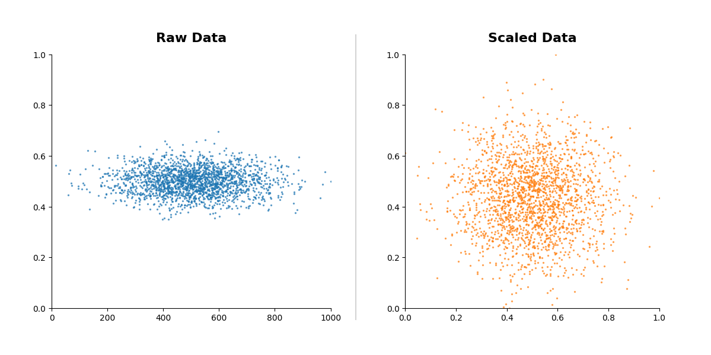

# Data Formats and Structures

## The Spectrum of Data Structure {.allowframebreaks}

Understanding the underlying organization of data is the first step in the pipeline.

### 1. Structured Data

  * **Definition:** Data that adheres to a pre-defined data model and is therefore straightforward to analyze.
  * **Format:** Rows and columns (Tabular).
  * **Schema:** Rigid (Schema-on-write).
  * **Examples:** Relational Databases (SQL), Excel files.

### 2. Unstructured Data

  * **Definition:** Information that either does not have a pre-defined data model or is not organized in a pre-defined manner.
  * **Format:** Text, Binary, Media.
  * **Schema:** None (Schema-on-read).
  * **Examples:** PDF documents, Video, Audio, Plain Text emails, Social Media posts.

### 3. Semi-Structured Data

  * **Definition:** Data that does not reside in a relational database but has organizational properties that make it easier to analyze. It uses "tags" or "markers" to separate semantic elements and enforce hierarchies.
  * **Format:** Hierarchical trees or Key-Value pairs.
  * **Examples:** JSON, XML, YAML, NoSQL databases.

---

![Ilustration of [Un|Semi]Structured organization](./figures/01.png){ width=256px }

![Examples of [Un|Semi]Structured Files](./figures/02.png){ width=256px }

## Semi-Structured Formats {.allowframebreaks}

### CSV (Comma Separated Values)

  * **Structure:** Flat text file where lines are rows and commas separate columns.
  * **Pros:** Universally supported, extremely lightweight.
  * **Cons:** No support for types (everything is a string/number), no nesting/hierarchy.

### XML (eXtensible Markup Language)

  * **Structure:** Tree-based structure using custom opening/closing tags.
  * **Pros:** Standard for legacy web services (SOAP), supports complex hierarchy and schemas (XSD).
  * **Cons:** Verbose (heavy storage footprint due to repeated tags), harder to parse than JSON.

### JSON (JavaScript Object Notation)

  * **Structure:** Key-Value pairs using brackets `{}` for objects and `[]` for arrays.
  * **Pros:** The standard for modern Web APIs (REST), native mapping to Python Dictionaries, human-readable.
  * **Cons:** Keys are repeated for every record (verbose).

### YAML (YAML Ain't Markup Language)

  * **Structure:** Relies on whitespace indentation to define hierarchy.
  * **Pros:** The most human-readable format; perfect for configuration files (Docker, Kubernetes).
  * **Cons:** Indentation errors can break the file easily; parsing can be slower than JSON.

### BSON (Binary JSON)

  * **Structure:** A binary-encoded serialization of JSON-like documents.
  * **Pros:** Optimized for speed (traversal) and space; supports types JSON does not (e.g., `Date`, `BinData`).
  * **Cons:** Not human-readable without a decoder. Used primarily in MongoDB.

## Example: "Employee Record" {.allowframebreaks}

Here is a dataset containing two records represented in all formats.
Note how "lists" of employees are handled.

**1. CSV**

No native nesting. "Skills" list requires a custom separator (e.g., pipe |).

```csv
id,name,skills,active
1,"Jane Doe","Python|SQL",true
2,"Bob Smith","Java|C++",false


```

**2. XML**

Requires a root tag to wrap multiple children.

```xml
<employees>
    <employee id="1">
        <name>Jane Doe</name>
        <skills><skill>Python</skill><skill>SQL</skill>
        </skills>
        <active>true</active>
    </employee>
    <employee id="2">
        <name>Bob Smith</name>
        <skills><skill>Java</skill><skill>C++</skill>
        </skills>
        <active>false</active>
    </employee>
</employees>
```

**3. JSON**

JSON uses square brackets `[]` to denote a list.

```json
{"employees": [{
      "id": 1, "name": "Jane Doe",
      "skills": ["Python", "SQL"], "active": true
    },
    {
      "id": 2, "name": "Bob Smith",
      "skills": ["Java", "C++"], "active": false
    }]
}


```

**4. YAML**

YAML uses dashes `-` to denote list items.

```yaml
employees:
  - id: 1
    name: Jane Doe
    skills: [Python, SQL]
    active: true
  - id: 2
    name: Bob Smith
    skills:
      - Java
      - C++
    active: false
```

# Data Loading & Manipulation

## The DataFrame Concept

A **DataFrame** is the central data structure in data science (used by R, Pandas, Polars, Spark).

  * **Conceptual Model:** An in-memory spreadsheet.
  * **Structure:**
      * **Index:** Labels for rows (axis 0).
      * **Columns:** Labels for variables (axis 1).
      * **Cells:** The intersection holding the data.
  * **Homogeneity:** A single column usually holds a single data type (e.g., all Integers), but different columns can hold different types.

{ width=128px }

## Pandas

* **Core Philosophy:** Eager execution. Code runs line-by-line immediately, making debugging and exploration intuitive.
* **Key Architecture:**
    * **Single-Threaded:** Primarily runs on a single CPU core.
    * **Index-Based:** Relies heavily on explicit row labels (Indices) for data alignment, which is crucial for time-series analysis.
* **Why use it?**
    * **Unrivaled Ecosystem:** It is the default input for Scikit-Learn, Matplotlib, and thousands of other libraries.
    * **Maturity:** If a data problem exists, there is a StackOverflow answer for how to solve it in Pandas.

## Polars

* **Core Philosophy:** Lazy Evaluation. It builds an optimized query plan before execution to minimize work and memory usage.
* **Key Architecture:**
    * **Multi-Threaded (Rust):** Written in Rust to bypass Python limitations, utilizing **all available CPU cores** for parallel processing.
    * **Apache Arrow:** Uses a columnar memory format that allows for zero-copy data transfer and efficient caching.
* **Why use it?**
    * **Performance:** Significantly faster than Pandas on large datasets (10x-100x speedups are common).
    * **Streaming:** Can process datasets larger than your computer's RAM.

## Library Comparison: Pandas vs. Polars

| Feature | **Pandas** | **Polars** |
| :--- | :--- | :--- |
| **History** | Created in 2008. The industry standard. | Newer (2020s). Built for performance. |
| **Backend** | Python/C / Cython. | **Rust** (Safety & Speed). |
| **Execution** | **Eager**: Runs line-by-line immediately. | **Lazy & Eager**: Can optimize the whole query plan before running. |
| **Parallelism** | Single-threaded (mostly). | **Multi-threaded** (Native parallelization). |
| **Memory** | Copies data often (High RAM usage). | **Arrow Memory Format** (Zero-copy, efficient). |

## Data Cleaning: Missing Values (Imputation) {.allowframebreaks}

Data often has gaps (`NaN` or `Null`).
You must decide to **drop** them or **fill** them.
Missing data can be filled in with the mean (continous values) or mode (discrete values).

  * **Pandas Approach:**

    ```python
    # Drop rows with any missing values
    df.dropna()


    # Fill with Mean (Imputation)
    mean_val = df['salary'].mean()
    df['salary'].fillna(mean_val, inplace=True)


    ```

  * **Polars Approach:**

    ```python
    # Drop rows with any missing values
    df.drop_nans()

    # Fill with Mean
    df.with_columns(
        pl.col("salary")
        .fill_null(pl.col("salary")
        .mean())
    )
    ```

## Data Cleaning: Outliers with IQR {.allowframebreaks}

Outliers are extreme values that deviate from other observations.
We use the **Interquartile Range (IQR)** to detect them.

**The Math:**

1.  **Q1 (25th Percentile):** The middle number between the smallest number and the median.
2.  **Q3 (75th Percentile):** The middle number between the median and the highest number.
3.  **IQR Formula:** $$IQR = Q_3 - Q_1$$

**The Filter:**
Data $D$ is an outlier if:
$$D < (Q_1 - 1.5 \times IQR) \quad \text{or} \quad D > (Q_3 + 1.5 \times IQR)$$

**Implementation (Pandas):**

```python
Q1 = df['age'].quantile(0.25)
Q3 = df['age'].quantile(0.75)
IQR = Q3 - Q1
# Filtering
df_clean = df[~((df['age'] < (Q1 - 1.5 * IQR)) |
(df['age'] > (Q3 + 1.5 * IQR)))]


```

**Implementation (Polars):**

```python
Q1 = df["age"].quantile(0.25, interpolation="linear")
Q3 = df["age"].quantile(0.75, interpolation="linear")
IQR = Q3 - Q1
# Filtering
df_clean = df.filter(
    pl.col("age").is_between(q1 - 1.5 * iqr, q3 + 1.5 * iqr)
)
```

## Data Scaling {.allowframebreaks}

Scaling the data can help to balance the impact of all variables on the distance calculation and can help to improve the performance of the algorithm.

{ width=256px }

**A. Min-Max Scaling (Normalization)**

  * **Goal:** Squeeze data into a range $[0, 1]$.
  * **Formula:** $$X_{norm} = \frac{X - X_{min}}{X_{max} - X_{min}}$$
  * **Usage:** Image processing (pixels 0-255), Neural Networks.

**B. Standard Scaling (Z-Score Standardization)**

  * **Goal:** Center data around Mean=0 with Std Dev=1.
  * **Formula:** $$Z = \frac{X - \mu}{\sigma}$$
  * **Usage:** PCA, Logistic Regression, Clustering.

## Statistics: Correlation & Summaries {.allowframebreaks}

**Summaries (Central Tendency & Dispersion):**

  * **Mean:** Average.
  * **Median:** Middle value (Robust to outliers).
  * **Mode:** Most frequent value.
  * **Quartiles:** Distribution checkpoints (25%, 50%, 75%).

**Correlation (Pearson):**

  * Measures linear relationship between $-1$ (perfect negative) and $+1$ (perfect positive).
  * $0$ means no linear correlation.

**Code Example:**

```python
# Pandas/Polars Summary
# Returns count, mean, std,
# min, 25%, 50%, 75%, max
print(df.describe())

# Pandas Correlation Matrix
print(df.corr())
```

# Data Visualization

## Matplotlib vs. Seaborn {.allowframebreaks}

**Matplotlib:**

  * **Role:** The engine.
  * **Philosophy:** "Make easy things easy and hard things possible."
  * **Control:** Granular control over every axis, tick, line style, and canvas element.
  * **Syntax:** Imperative (Step-by-step construction).

**Seaborn:**

  * **Role:** The interface.
  * **Philosophy:** "Draw attractive and informative statistical graphics."
  * **Control:** Automates color mapping, legends, and statistical aggregation.
  * **Syntax:** Declarative (Describe *what* you want, not how to draw it).

## Best Plots for Analysis Types i

### 1. Analysis: Distribution (Univariate)

  * **Goal:** See the spread and shape of data.
  * **Plot:** **Histogram** or **KDE** (Kernel Density Estimate).
  * **Example:** `sns.histplot(data=df, x="price", kde=True)`

  { width=256px }

## Best Plots for Analysis Types ii

### 2. Analysis: Correlation (Bivariate)

  * **Goal:** See how two variables relate.
  * **Plot:** **Scatter Plot** or **Heatmap**.
  * **Example:** `sns.scatterplot(data=df, x="age", y="salary")`

  { width=256px }

## Best Plots for Analysis Types iii

### 3. Analysis: Comparison (Categorical)

  * **Goal:** Compare values across groups.
  * **Plot:** **Bar Chart** (aggregates) or **Box Plot** (distributions).
  * **Example:** `sns.boxplot(data=df, x="department", y="salary")`

  { width=256px }

## Best Plots for Analysis Types iv

### 4. Analysis: Comparison (Distribution Density)

  * **Goal:** Compare the distribution and probability.
  * **Plot:** **Violin Plot**.
  * **Example:** `sns.violinplot(data=df, x="department", y="salary")`

  { width=256px }

## Exporting: Raster vs. Vector {.allowframebreaks}

When saving your figures (`plt.savefig`), the extension determines the technology.

| Feature | **Raster (Bitmap)** | **Vector** |
| :--- | :--- | :--- |
| **Formats** | `.png`, `.jpg`, `.bmp` | `.pdf`, `.svg`, `.eps` |
| **Composition** | Grid of colored pixels. | Mathematical formulas (paths, curves). |
| **Scalability** | Loses quality when zoomed (pixelates). | Infinite scalability (sharp at any zoom). |
| **File Size** | Large for high resolution. | Small (unless containing thousands of scatter points). |
| **Usage** | Web, PowerPoints, Quick previews. | **Academic Papers, Printing, Posters.** |

# Jupyter Notebooks

## The Interactive Framework {.allowframebreaks}

**Jupyter** (JUlia, PYThon, R) is a web-based interactive computing platform. It is a JSON document containing an ordered list of input/output cells.

### Key Features

1.  **Literate Programming:** Mixes executable code with narrative text (Markdown), equations ("LaTeX"), and images.
2.  **The Kernel:** The computational engine (e.g., IPython) runs in the background. It maintains the "state" (variables remain in memory between cells).
3.  **Visualization:** Plots render inline directly below the code that generated them.

## Effective Usage Workflow {.allowframebreaks}

**1. The "Markdown" Cell**
Use for documentation. Supports headers (`#`), bolding (`**`), and lists to explain methodology *before* the code.

**2. The "Code" Cell**
Runs Python. The last line of a cell is automatically printed (no `print()` needed).

**3. Magic Commands**

  * `%matplotlib inline`: Embeds plots in the notebook.
  * `%timeit`: Runs a line multiple times to benchmark performance.
  * `!pip install X`: Runs shell commands to install libraries inside the notebook.

# Further Reading

  * **Pandas Documentation:** [pandas.pydata.org](https://pandas.pydata.org/docs/) - The definitive guide.
  * **Polars User Guide:** [pola.rs](https://pola.rs/) - Essential for high-performance data manipulation.
  * **Seaborn Gallery:** [seaborn.pydata.org](https://seaborn.pydata.org/examples/index.html) - Visual inspiration for plots.
  * **Matplotlib Anatomy of a Plot:** [matplotlib.org](https://matplotlib.org/stable/gallery/showcase/anatomy.html) - Understanding the object hierarchy.
  * **Project Jupyter:** [jupyter.org](https://jupyter.org/)